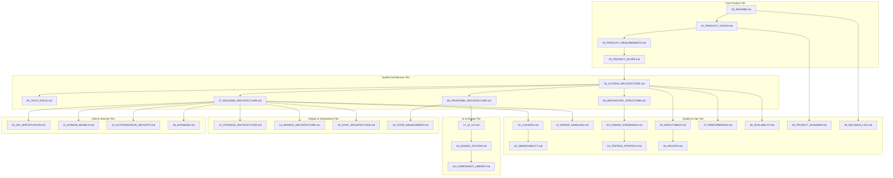

# BucketSpace Architecture & Context Hub (00_README.md)

Welcome to the **BucketSpace Engineering Operating System**. This `/context` directory serves as the **Single Source of Truth (SSOT)** for all product requirements, system architectures, database schemas, API specifications, coding standards, and operational playbooks.

Every future engineer, technical lead, and AI coding agent MUST treat these documents as binding architectural contracts.

---

## 1. Context Document Map & Navigation Graph

---

## 2. Directory Index & Document Summary

| Document | Name | Core Responsibilities |
|---|---|---|
| [PROJECT_STATE.md](file:///c:/Users/Vanrajsinh/Desktop/DevVault/Building-Hub/BucketSpace/context/PROJECT_STATE.md) | Active Project State & Memory | Active goals, current architectural baseline, rules, roadmap status. |
| [00_README.md](file:///c:/Users/Vanrajsinh/Desktop/DevVault/Building-Hub/BucketSpace/context/00_README.md) | Master Index & Operating System | Navigation graph, document contracts, AI operating guidelines. |
| [01_PRODUCT_VISION.md](file:///c:/Users/Vanrajsinh/Desktop/DevVault/Building-Hub/BucketSpace/context/01_PRODUCT_VISION.md) | Product Vision & Mission | Product pillars, target personas, 10-year technical roadmap. |
| [02_PRODUCT_REQUIREMENTS.md](file:///c:/Users/Vanrajsinh/Desktop/DevVault/Building-Hub/BucketSpace/context/02_PRODUCT_REQUIREMENTS.md) | PRD & Business Rules | User stories, functional & non-functional requirements. |
| [03_PROJECT_SCOPE.md](file:///c:/Users/Vanrajsinh/Desktop/DevVault/Building-Hub/BucketSpace/context/03_PROJECT_SCOPE.md) | Scope & MVP Boundaries | In-scope vs out-of-scope, phase boundaries. |
| [04_SYSTEM_ARCHITECTURE.md](file:///c:/Users/Vanrajsinh/Desktop/DevVault/Building-Hub/BucketSpace/context/04_SYSTEM_ARCHITECTURE.md) | High-Level System Design | C4 models, multi-cloud abstraction topology, service boundaries. |
| [05_TECH_STACK.md](file:///c:/Users/Vanrajsinh/Desktop/DevVault/Building-Hub/BucketSpace/context/05_TECH_STACK.md) | Technology Stack & Tradeoffs | Framework choices, database selections, library matrix. |
| [06_REPOSITORY_STRUCTURE.md](file:///c:/Users/Vanrajsinh/Desktop/DevVault/Building-Hub/BucketSpace/context/06_REPOSITORY_STRUCTURE.md) | Codebase Architecture | Monorepo layout, module rules, dependency constraints. |
| [07_BACKEND_ARCHITECTURE.md](file:///c:/Users/Vanrajsinh/Desktop/DevVault/Building-Hub/BucketSpace/context/07_BACKEND_ARCHITECTURE.md) | Backend Architecture | API Gateway, streaming pipelines, background worker queues. |
| [08_FRONTEND_ARCHITECTURE.md](file:///c:/Users/Vanrajsinh/Desktop/DevVault/Building-Hub/BucketSpace/context/08_FRONTEND_ARCHITECTURE.md) | Frontend Architecture | Next.js 15 App Router, streaming SSR, worker threads. |
| [09_DATABASE.md](file:///c:/Users/Vanrajsinh/Desktop/DevVault/Building-Hub/BucketSpace/context/09_DATABASE.md) | Database & Vector Schema | PostgreSQL + pgvector schema, indexes, migrations. |
| [10_API_SPECIFICATION.md](file:///c:/Users/Vanrajsinh/Desktop/DevVault/Building-Hub/BucketSpace/context/10_API_SPECIFICATION.md) | API Contracts & Webhooks | REST, WebSocket event protocol, presigned URL mechanics. |
| [11_DOMAIN_MODELS.md](file:///c:/Users/Vanrajsinh/Desktop/DevVault/Building-Hub/BucketSpace/context/11_DOMAIN_MODELS.md) | Domain-Driven Design (DDD) | Entities, aggregates, value objects, domain events. |
| [12_AUTHORIZATION_SECURITY.md](file:///c:/Users/Vanrajsinh/Desktop/DevVault/Building-Hub/BucketSpace/context/12_AUTHORIZATION_SECURITY.md) | Security & Access Control | OAuth2/OIDC, fine-grained RBAC/ABAC, encryption standards. |
| [13_STORAGE_ARCHITECTURE.md](file:///c:/Users/Vanrajsinh/Desktop/DevVault/Building-Hub/BucketSpace/context/13_STORAGE_ARCHITECTURE.md) | Storage Abstraction Layer | Multi-cloud adapters (S3, R2, GCS, Azure), chunked uploads. |
| [14_SEARCH_ARCHITECTURE.md](file:///c:/Users/Vanrajsinh/Desktop/DevVault/Building-Hub/BucketSpace/context/14_SEARCH_ARCHITECTURE.md) | Full-Text & Vector Search | Meilisearch + pgvector semantic CLIP/Whisper search. |
| [15_SYNC_ARCHITECTURE.md](file:///c:/Users/Vanrajsinh/Desktop/DevVault/Building-Hub/BucketSpace/context/15_SYNC_ARCHITECTURE.md) | Real-Time Sync & CRDT | WebSocket pub/sub, optimistic state updates, offline queue. |
| [16_STATE_MANAGEMENT.md](file:///c:/Users/Vanrajsinh/Desktop/DevVault/Building-Hub/BucketSpace/context/16_STATE_MANAGEMENT.md) | Client State Hierarchy | Zustand stores, TanStack Query server cache mechanics. |
| [17_UI_UX.md](file:///c:/Users/Vanrajsinh/Desktop/DevVault/Building-Hub/BucketSpace/context/17_UI_UX.md) | UI/UX Principles | Interaction design, workspace visual layouts, WCAG 2.1. |
| [18_DESIGN_SYSTEM.md](file:///c:/Users/Vanrajsinh/Desktop/DevVault/Building-Hub/BucketSpace/context/18_DESIGN_SYSTEM.md) | Design Tokens & Theme | Color tokens, typography, glassmorphic UI utilities. |
| [19_COMPONENT_LIBRARY.md](file:///c:/Users/Vanrajsinh/Desktop/DevVault/Building-Hub/BucketSpace/context/19_COMPONENT_LIBRARY.md) | React Component Library | Atomic UI components, FileViewer, BucketTree specs. |
| [20_CODING_STANDARDS.md](file:///c:/Users/Vanrajsinh/Desktop/DevVault/Building-Hub/BucketSpace/context/20_CODING_STANDARDS.md) | Code Quality & AI Rules | TypeScript rules, linting, naming rules, AI prompt constraints. |
| [21_ERROR_HANDLING.md](file:///c:/Users/Vanrajsinh/Desktop/DevVault/Building-Hub/BucketSpace/context/21_ERROR_HANDLING.md) | Universal Error Handling | Taxonomy of errors, HTTP/GRPC mapping, React boundaries. |
| [22_LOGGING.md](file:///c:/Users/Vanrajsinh/Desktop/DevVault/Building-Hub/BucketSpace/context/22_LOGGING.md) | Structured Logging | JSON log format, W3C trace context, audit trail logging. |
| [23_OBSERVABILITY.md](file:///c:/Users/Vanrajsinh/Desktop/DevVault/Building-Hub/BucketSpace/context/23_OBSERVABILITY.md) | Metrics, Traces & Alerts | OpenTelemetry metrics, Prometheus, Grafana, alerting thresholds. |
| [24_TESTING_STRATEGY.md](file:///c:/Users/Vanrajsinh/Desktop/DevVault/Building-Hub/BucketSpace/context/24_TESTING_STRATEGY.md) | Quality Assurance | Vitest unit tests, Playwright E2E, k6 load testing scripts. |
| [25_DEPLOYMENT.md](file:///c:/Users/Vanrajsinh/Desktop/DevVault/Building-Hub/BucketSpace/context/25_DEPLOYMENT.md) | Deployment & IaC | Docker containers, Terraform blueprints, Helm charts. |
| [26_DEVOPS.md](file:///c:/Users/Vanrajsinh/Desktop/DevVault/Building-Hub/BucketSpace/context/26_DEVOPS.md) | CI/CD Pipelines | GitHub Actions workflows, secret isolation, release tagging. |
| [27_PERFORMANCE.md](file:///c:/Users/Vanrajsinh/Desktop/DevVault/Building-Hub/BucketSpace/context/27_PERFORMANCE.md) | Performance Budgets | Core Web Vitals, zero-copy streaming, memory limits. |
| [28_SCALABILITY.md](file:///c:/Users/Vanrajsinh/Desktop/DevVault/Building-Hub/BucketSpace/context/28_SCALABILITY.md) | System Scaling Strategies | Horizontal auto-scaling, sharding, caching topologies. |
| [29_PROJECT_ROADMAP.md](file:///c:/Users/Vanrajsinh/Desktop/DevVault/Building-Hub/BucketSpace/context/29_PROJECT_ROADMAP.md) | Phase Roadmap | Development phases (Phase 1 to Phase 4), complexity estimates. |
| [30_DECISION_LOG.md](file:///c:/Users/Vanrajsinh/Desktop/DevVault/Building-Hub/BucketSpace/context/30_DECISION_LOG.md) | Architectural Decision Records | Baseline ADRs (001-010) explaining critical decisions. |
| [BUG_TRACKER.md](file:///c:/Users/Vanrajsinh/Desktop/DevVault/Building-Hub/BucketSpace/context/BUG_TRACKER.md) | Engineering Bug & Issue Tracker | Official registry of all bugs, root causes, remediations, and regression tests. |
| [SECURITY_FINDINGS.md](file:///c:/Users/Vanrajsinh/Desktop/DevVault/Building-Hub/BucketSpace/context/SECURITY_FINDINGS.md) | Vulnerability Inventory | Red-team vulnerability findings and security remediations (SEC-01–SEC-06). |
| [TELEGRAM_CREDENTIALS_GUIDE.md](file:///c:/Users/Vanrajsinh/Desktop/DevVault/Building-Hub/BucketSpace/context/TELEGRAM_CREDENTIALS_GUIDE.md) | Telegram Credentials Guide | Step-by-step 60-second guide to obtain API ID and API Hash from my.telegram.org. |

---

## 3. Living Documentation Protocol

The `/context` directory is a **living architectural contract**. When making system changes:

1. **Rule of Architectural Parity**: Code changes without corresponding updates to `/context` documents are INVALID and will fail review.
2. **Decision Protocol**: Any structural, schema, or technological shift must be appended to [30_DECISION_LOG.md](file:///c:/Users/Vanrajsinh/Desktop/DevVault/Building-Hub/BucketSpace/context/30_DECISION_LOG.md) as a new ADR before implementation.
3. **Cross-Referencing**: Every document must explicitly cross-reference related components using relative markdown file links.

---

## 4. Mandatory Guidelines for AI Coding Agents

If you are an AI coding assistant (e.g. Antigravity, Copilot, Claude):

> [!CAUTION]
> **AI AGENT STRICT DIRECTIVES**
> 1. You MUST read the relevant `/context` documents BEFORE modifying or writing code.
> 2. You MUST NOT guess file paths, API contracts, database schemas, or state models. Refer strictly to [06_REPOSITORY_STRUCTURE.md](file:///c:/Users/Vanrajsinh/Desktop/DevVault/Building-Hub/BucketSpace/context/06_REPOSITORY_STRUCTURE.md), [09_DATABASE.md](file:///c:/Users/Vanrajsinh/Desktop/DevVault/Building-Hub/BucketSpace/context/09_DATABASE.md), and [10_API_SPECIFICATION.md](file:///c:/Users/Vanrajsinh/Desktop/DevVault/Building-Hub/BucketSpace/context/10_API_SPECIFICATION.md).
> 3. You MUST adhere to coding style and safety rules defined in [20_CODING_STANDARDS.md](file:///c:/Users/Vanrajsinh/Desktop/DevVault/Building-Hub/BucketSpace/context/20_CODING_STANDARDS.md).
> 4. If a requested change contradicts any document in `/context`, STOP and ask the user to clarify or update the context first.

---

## 5. Definition of Done for Context Updates

A context update is complete ONLY when:
- [x] All impacted files cross-referenced in the document map are updated.
- [x] Mermaid diagrams reflect current system topology accurately.
- [x] New ADR added to [30_DECISION_LOG.md](file:///c:/Users/Vanrajsinh/Desktop/DevVault/Building-Hub/BucketSpace/context/30_DECISION_LOG.md) if an architectural decision was modified.
- [x] Zero placeholder text, missing links, or unverified claims remain.
