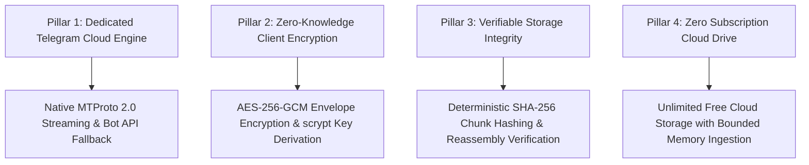

# Product Vision & Mission (01_PRODUCT_VISION.md)

## 1. Executive Summary & Purpose
**BucketSpace** is an open-source, zero-subscription personal cloud storage engine powered exclusively by Telegram MTProto. It turns your private Telegram account into a secure, high-performance personal cloud drive featuring zero-knowledge client-side encryption (AES-256-GCM), adaptive multi-part chunking, and 100% cryptographic SHA-256 integrity verification.

---

## 2. Product Pillars & Core Value Proposition

### Pillar 1: Dedicated Telegram Cloud Engine
- **Native MTProto 2.0 Streaming**: Direct connection to Telegram's cloud via GramJS MTProto 2.0 protocol using private session credentials, supporting multi-gigabyte file transfers.
- **Bot API Fallback**: Standard bot-based transport for lightweight deployments.

### Pillar 2: Zero-Knowledge Client Encryption
- **Client-Side Cryptography**: Files are encrypted with AES-256-GCM locally before leaving your device.
- **No Cloud Inspection**: Telegram and network intermediaries only see opaque encrypted ciphertext chunks.

### Pillar 3: Verifiable Storage Integrity
- **SHA-256 Invariants**: Every chunk is validated upon upload, download, and reassembly.
- **Bitrot Prevention**: Cryptographic integrity ensures byte-identical file downloads.

### Pillar 4: High-Performance Streaming Pipeline
- **Bounded RAM Footprint**: Multi-gigabyte media is dynamically sliced into 512KB–20MB bounded chunks.
- **Resumable Transfers**: Interrupted transfers resume seamlessly without re-uploading completed chunks.

---

## 3. Cross-References
- Product Requirements & User Stories: [02_PRODUCT_REQUIREMENTS.md](file:///c:/Users/Vanrajsinh/Desktop/DevVault/Building-Hub/BucketSpace/context/02_PRODUCT_REQUIREMENTS.md)
- High-Level Architecture Topology: [04_SYSTEM_ARCHITECTURE.md](file:///c:/Users/Vanrajsinh/Desktop/DevVault/Building-Hub/BucketSpace/context/04_SYSTEM_ARCHITECTURE.md)
- Storage Architecture: [13_STORAGE_ARCHITECTURE.md](file:///c:/Users/Vanrajsinh/Desktop/DevVault/Building-Hub/BucketSpace/context/13_STORAGE_ARCHITECTURE.md)

