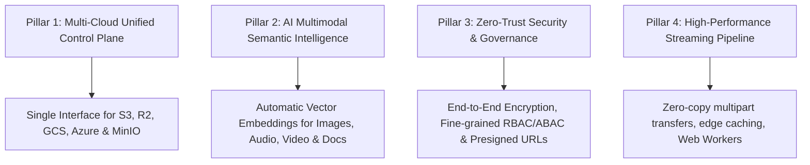

# Product Vision & Mission (01_PRODUCT_VISION.md)

## 1. Executive Summary & Purpose
**BucketSpace** is an AI-first, multi-cloud object storage workspace designed to replace fragmented cloud storage consoles (AWS S3 Console, GCP Storage Browser, Azure Portal) and siloed digital asset management (DAM) platforms. It unifies cloud object buckets, edge object stores (Cloudflare R2, MinIO), and local file stores into a single, lightning-fast visual workspace featuring real-time collaboration, zero-trust security, and automatic multimodal AI semantic indexing.

---

## 2. Product Pillars & Core Value Proposition

### Pillar 1: Multi-Cloud Unified Control Plane
- **Single Pane of Glass**: Manage buckets across AWS, GCP, Azure, Cloudflare, and on-premise S3-compatible stores from a unified interface without vendor lock-in.
- **Provider Agnostic Workflows**: Move, mirror, or transform objects across providers with declarative sync rules and background worker pipelines.

### Pillar 2: AI Multimodal Semantic Intelligence
- **Zero-Tagging Search**: Automatically generate CLIP embeddings for visual media, Whisper transcripts for audio/video, and chunked text vector embeddings for documents into PostgreSQL `pgvector`.
- **Natural Language Discovery**: Query files using conversational language (e.g., *"Find the high-res 4k product render with dark blue background"*).

### Pillar 3: Zero-Trust Security & Governance
- **Strict Presigned Operations**: Direct client-to-cloud bucket uploads/downloads via cryptographically signed temporary URLs; API servers never proxy payload data unless transforming.
- **Immutable Audit Trails**: Every read, write, copy, and permission delegation is cryptographically logged for SOC2 and HIPAA compliance.

### Pillar 4: High-Performance Streaming Pipeline
- **Zero-Copy Transfers**: Browser-side chunked multipart uploads using Web Workers and streams.
- **Instant Media Streaming**: HLS video transcoding on demand and dynamic image resizing at the edge.

---

## 3. Target User Personas

| Persona | Key Pain Point | BucketSpace Solution |
|---|---|---|
| **DevOps & Cloud Engineers** | Juggling credentials and clunky AWS/GCP web UI consoles. | Unified CLI, API, and keyboard-driven web workspace with instant multi-cloud search. |
| **Media & Creative Studios** | Slow file sharing of gigabyte video renders and lost assets. | Instant video streaming preview, zero-copy sharing links, visual asset versioning. |
| **Data Science & AI Teams** | Unstructured datasets trapped in S3 buckets without searchable metadata. | Automatic semantic indexing, dataset versioning, vector similarity queries. |
| **Enterprise Security Officers** | Shadow IT, unencrypted S3 buckets, and broad IAM credentials. | Centralized RBAC/ABAC enforcement, automated lifecycle encryption, presigned URL access. |

---

## 4. Architectural Decisions & Tradeoffs

### Decision 1: Direct-to-Storage Presigned Uploads over Backend Streaming Proxy
- **Reasoning**: Proxying gigabytes of file payload data through Node.js/Next.js web servers saturates CPU and bandwidth, creating massive scalability bottlenecks.
- **Benefits**: Near-zero server bandwidth utilization; client uploads directly to S3/R2 endpoints at full line-speed.
- **Tradeoffs**: Requires backend to coordinate presigned URL issuance and POST-upload metadata completion hooks.
- **Alternatives Considered**: Proxying all uploads through Next.js API routes (rejected due to memory and server cost limits).

### Decision 2: Multi-Model Vector Indexing (CLIP + Whisper + Text) in `pgvector`
- **Reasoning**: Storing relational bucket metadata separately from vector embeddings in external vector databases introduces dual-write synchronization bugs.
- **Benefits**: Single ACID database for metadata, permissions, and vector similarity search.
- **Tradeoffs**: Requires PostgreSQL index tuning (`HNSW` / `IVFFlat`) as vector count scales beyond 10M vectors.
- **Alternatives Considered**: External Pinecone/Qdrant integration (deferred to enterprise high-scale plugin phase).

---

## 5. Cross-References
- Product Requirements & User Stories: [02_PRODUCT_REQUIREMENTS.md](file:///c:/Users/Vanrajsinh/Desktop/DevVault/Building-Hub/BucketSpace/context/02_PRODUCT_REQUIREMENTS.md)
- High-Level Architecture Topology: [04_SYSTEM_ARCHITECTURE.md](file:///c:/Users/Vanrajsinh/Desktop/DevVault/Building-Hub/BucketSpace/context/04_SYSTEM_ARCHITECTURE.md)
- Multi-Cloud Storage Architecture: [13_STORAGE_ARCHITECTURE.md](file:///c:/Users/Vanrajsinh/Desktop/DevVault/Building-Hub/BucketSpace/context/13_STORAGE_ARCHITECTURE.md)

---

## 6. Definition of Done for Product Vision Alignment
- [x] All features built align directly with one of the 4 core product pillars.
- [x] Every storage operation supports presigned client-to-cloud security semantics.
- [x] Zero vendor-specific UI code leaked into client components.
