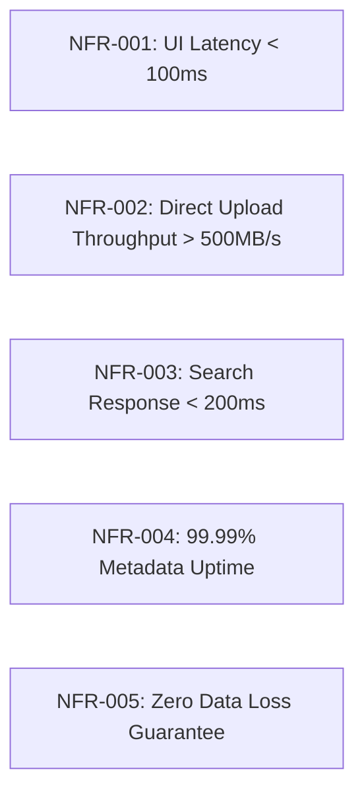

# Product Requirements Document (02_PRODUCT_REQUIREMENTS.md)

## 1. Document Overview & Scope
This document specifies the **Functional (FR)** and **Non-Functional Requirements (NFR)** for **BucketSpace**. It defines business rules, validation criteria, and acceptance standards for all engineering teams and AI coding agents.

---

## 2. Functional Requirements (FR)

### Module 1: Bucket & Storage Provider Management
- **FR-001 (Provider Integration)**: System MUST allow registration of AWS S3, Cloudflare R2, Google Cloud Storage (GCS), Azure Blob Storage, and custom MinIO/S3-compatible endpoints using API keys/credentials stored in encrypted secrets vault.
- **FR-002 (Unified Bucket Navigation)**: System MUST present a unified tree navigation combining buckets across multiple providers into logical Workspaces.
- **FR-003 (Bucket Mirroring & Sync)**: System MUST allow setting automated sync pipelines between buckets across different cloud providers (e.g. AWS S3 bucket -> Cloudflare R2 backup).

### Module 2: File Operations & Direct Upload Engine
- **FR-004 (Direct Chunked Upload)**: Files larger than 5MB MUST be uploaded via S3 Multipart Presigned URLs direct to cloud storage without traversing application web servers.
- **FR-005 (Pause/Resume Uploads)**: Upload engine MUST support chunked upload resume capability after network disconnection using localStorage state tracking.
- **FR-006 (Zero-Copy Move & Copy)**: Copying or moving objects between buckets on the same provider MUST execute cloud-native server-side copy operations (`CopyObject`).

### Module 3: AI Semantic Indexing & Search
- **FR-007 (Automatic Vector Embedding)**: Upon upload completion event, background worker jobs MUST compute embeddings:
  - Visual media (PNG, JPG, WEBP, MP4 frames): CLIP ViT-L/14 model (512-dim vector).
  - Audio files (MP3, WAV, M4A): Whisper speech-to-text -> text vector embedding.
  - Document text (PDF, DOCX, TXT, MD): Text chunking -> `text-embedding-3-small` (1536-dim vector).
- **FR-008 (Hybrid Semantic & Exact Search)**: System MUST execute hybrid search combining full-text lexical search (Meilisearch) and vector similarity search (`pgvector` HNSW index).

### Module 4: Access Control & Sharing
- **FR-009 (Fine-Grained Policy Engine)**: System MUST enforce workspace-level Role-Based Access Control (Owner, Admin, Editor, Viewer) and file-level Attribute-Based Access Control (e.g., tag-based restriction).
- **FR-010 (Time-Bounded Presigned Links)**: Public file sharing links MUST use presigned URLs with configurable expiration (15 minutes to 7 days) and optional password protection / max download count limit.

### Module 5: Collaboration & Real-Time Sync
- **FR-011 (Presence & Selection Sync)**: Multi-user workspace sessions MUST show active team member cursors, selected file highlights, and live upload progress over WebSockets.

---

## 3. Non-Functional Requirements (NFR)



- **NFR-001 (UI Responsiveness)**: Initial page render (LCP) MUST load in `< 1.2s`. User interaction response (INP) MUST be `< 50ms`.
- **NFR-002 (Search Speed)**: Hybrid search query execution across 1,000,000 files MUST return results in `< 200ms`.
- **NFR-003 (Upload Concurrency)**: Client upload engine MUST handle up to 20 concurrent file chunk upload threads per browser session without UI blocking.
- **NFR-004 (Security Compliance)**: All data at rest MUST be encrypted via AES-256 (or cloud provider SSE-S3/KMS). All API endpoints MUST enforce TLS 1.3.

---

## 4. Business & Validation Rules

```typescript
// Validation Rules Schema (Zod Specification Contract)
import { z } from 'zod';

export const BucketRegistrationSchema = z.object({
  name: z.string().min(3).max(63).regex(/^[a-z0-9.-]+$/),
  provider: z.enum(['AWS_S3', 'CLOUDFLARE_R2', 'GCP_STORAGE', 'AZURE_BLOB', 'MINIO']),
  region: z.string().min(1),
  endpoint: z.string().url().optional(),
  credentials: z.object({
    accessKeyId: z.string().min(16),
    secretAccessKey: z.string().min(16),
  }),
});

export const FileUploadPresignSchema = z.object({
  bucketId: z.string().uuid(),
  key: z.string().min(1),
  sizeBytes: z.number().positive().max(5 * 1024 * 1024 * 1024 * 1024), // 5 TB max
  contentType: z.string().min(1),
});
```

---

## 5. Common Edge Cases & Handling Strategies

| Edge Case | Root Cause | System Resolution Strategy |
|---|---|---|
| **Interrupted 10GB Upload** | Client browser closed or Wi-Fi dropped during chunk 45 of 100. | Background worker cleans up stale multipart uploads after 24 hours (`AbortMultipartUpload`). Client resumes from last confirmed chunk ID using `localStorage` cache state. |
| **S3 CORS Misconfiguration** | Bucket configured without CORS origin allowing BucketSpace domain. | Automated bucket diagnostic tool checks CORS policy upon bucket registration and provides a 1-click bucket policy setup script. |
| **Duplicate File Upload** | User uploads identical 500MB asset twice. | SHA-256 hash calculated in Web Worker before upload. If hash matches existing object in workspace, system prompts for zero-copy reference creation instead of re-uploading payload. |

---

## 6. Cross-References
- Product Vision: [01_PRODUCT_VISION.md](file:///c:/Users/Vanrajsinh/Desktop/DevVault/Building-Hub/BucketSpace/context/01_PRODUCT_VISION.md)
- Storage Architecture & Presigned Mechanics: [13_STORAGE_ARCHITECTURE.md](file:///c:/Users/Vanrajsinh/Desktop/DevVault/Building-Hub/BucketSpace/context/13_STORAGE_ARCHITECTURE.md)
- API Specs & Payload Schemas: [10_API_SPECIFICATION.md](file:///c:/Users/Vanrajsinh/Desktop/DevVault/Building-Hub/BucketSpace/context/10_API_SPECIFICATION.md)
