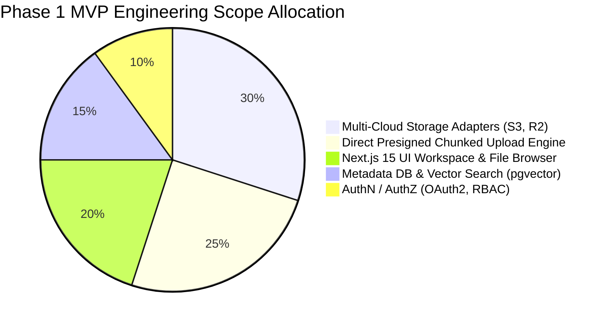
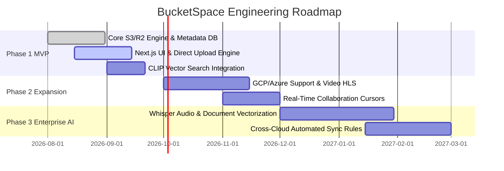

# Project Scope & MVP Boundaries (03_PROJECT_SCOPE.md)

## 1. Executive Summary
This document defines the strict operational scope for **BucketSpace**. It enforces feature boundaries, delineates Phase 1 MVP deliverables from post-MVP enhancements, and establishes feature flag control rules for developers and AI agents.

---

## 2. In-Scope vs. Out-of-Scope Matrix



| Feature Area | Phase 1 MVP (IN SCOPE) | Post-MVP / Future Expansion (OUT OF SCOPE) |
|---|---|---|
| **Storage Providers** | Telegram Cloud Storage Engine (Telegram MTProto / Bot API + Private Channel Storage). | AWS S3, Cloudflare R2, GCP Storage, Azure Blobs (Phase 2). |
| **Upload Engine** | Telegram Chunked Stream Uploads (20MB/2GB parts) & Direct Stream Pipeline. | Client-side video transcoding, client-side ZIP archive creation (Phase 2). |
| **Search Engine** | Hybrid Exact Text + CLIP Visual Embedding Search. | Audio Whisper transcription, OCR document extraction (Phase 3). |
| **Sync & Mirroring** | Manual file copy/move across buckets. | Automated real-time bucket replication & auto-sync rules (Phase 3). |
| **Collaboration** | Workspace invite links, RBAC (Owner, Admin, Viewer). | Live canvas annotation on 3D objects, real-time audio chat (Phase 4). |
| **Billing & Metering** | Basic storage quota tracking. | Automated multi-cloud cost optimization recommendation engine (Phase 4). |

---

## 3. Feature Flag Taxonomy

To prevent premature complexity from polluting codebase paths, all experimental or post-MVP capabilities MUST be guarded by environment feature flags using the `@bucketspace/feature-flags` module.

```typescript
export interface AppFeatureFlags {
  /** Phase 1 MVP Flags (Default: true) */
  ENABLE_S3_PROVIDER: boolean;
  ENABLE_R2_PROVIDER: boolean;
  ENABLE_PRESIGNED_MULTIPART_UPLOADS: boolean;
  ENABLE_VECTOR_SEMANTIC_SEARCH: boolean;

  /** Phase 2+ Guarded Flags (Default: false) */
  ENABLE_GCP_STORAGE_PROVIDER: boolean;
  ENABLE_AZURE_BLOB_PROVIDER: boolean;
  ENABLE_AUTOMATED_BUCKET_SYNC: boolean;
  ENABLE_HLS_VIDEO_TRANSCODING: boolean;
  ENABLE_REALTIME_COLLABORATIVE_CURSORS: boolean;
}
```

---

## 4. Phase Release Milestones



---

## 5. Explicit Constraints for AI Coding Agents

> [!WARNING]
> **STRICT SCOPE BOUNDARIES FOR AI AGENTS**
> 1. Do NOT implement GCP or Azure adapter logic unless explicitly working on a feature branch where `ENABLE_GCP_STORAGE_PROVIDER` or `ENABLE_AZURE_BLOB_PROVIDER` is set to `true`.
> 2. Do NOT add custom backend upload proxy endpoints. ALL upload flows MUST follow the S3 presigned URL architecture detailed in [13_STORAGE_ARCHITECTURE.md](file:///c:/Users/Vanrajsinh/Desktop/DevVault/Building-Hub/BucketSpace/context/13_STORAGE_ARCHITECTURE.md).
> 3. Do NOT create secondary databases. All metadata and vector data MUST reside in PostgreSQL `pgvector` as specified in [09_DATABASE.md](file:///c:/Users/Vanrajsinh/Desktop/DevVault/Building-Hub/BucketSpace/context/09_DATABASE.md).

---

## 6. Cross-References
- Product Vision: [01_PRODUCT_VISION.md](file:///c:/Users/Vanrajsinh/Desktop/DevVault/Building-Hub/BucketSpace/context/01_PRODUCT_VISION.md)
- Product Requirements PRD: [02_PRODUCT_REQUIREMENTS.md](file:///c:/Users/Vanrajsinh/Desktop/DevVault/Building-Hub/BucketSpace/context/02_PRODUCT_REQUIREMENTS.md)
- Project Roadmap Details: [29_PROJECT_ROADMAP.md](file:///c:/Users/Vanrajsinh/Desktop/DevVault/Building-Hub/BucketSpace/context/29_PROJECT_ROADMAP.md)
