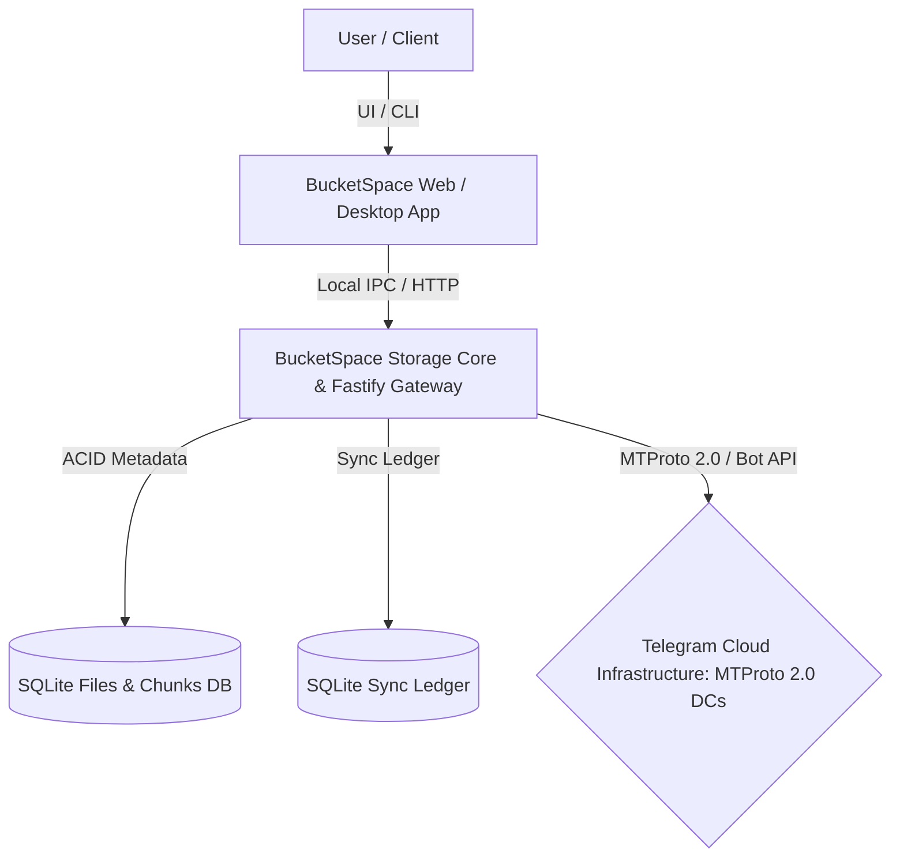
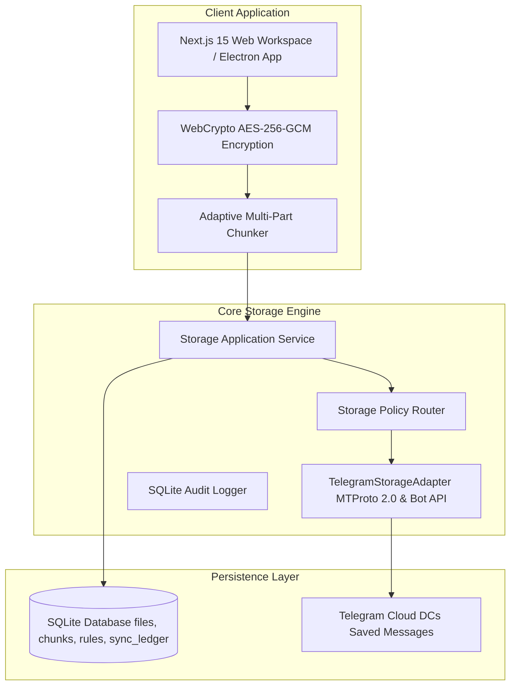
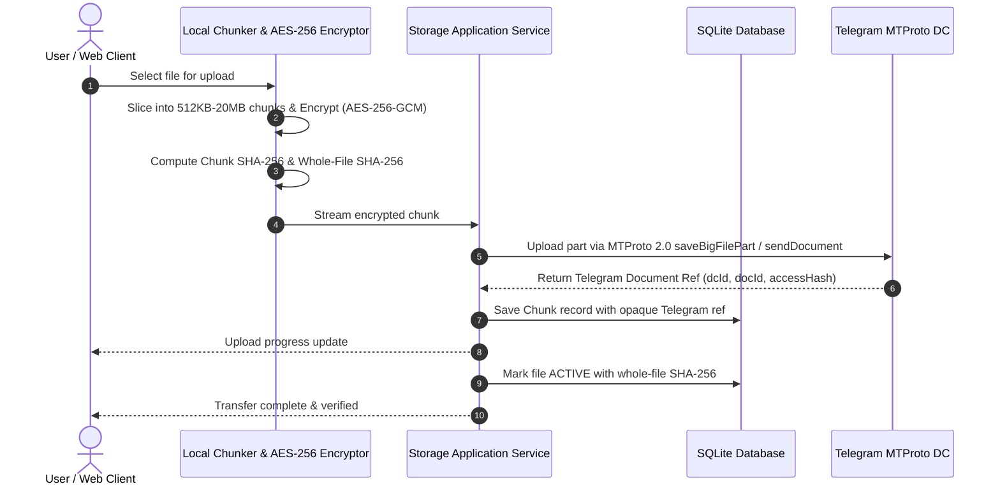

# System Architecture (04_SYSTEM_ARCHITECTURE.md)

## 1. Executive Summary & Architecture Goals
**BucketSpace** utilizes a lightweight, high-performance architecture optimized for zero-knowledge client-side encryption, deterministic chunking, and direct MTProto 2.0 streaming to Telegram cloud storage.

### Core Architectural Goals
1. **Direct Telegram MTProto Transport**: Payload traffic streams directly to Telegram's cloud infrastructure via GramJS MTProto 2.0.
2. **Local ACID Metadata**: Pure SQLite database with WAL mode and foreign key constraints for sub-millisecond file indexing.
3. **Zero-Knowledge Encryption**: AES-256-GCM envelope encryption performed client-side.
4. **100% Cryptographic Verification**: SHA-256 digests validated on every chunk and reassembled payload.

---

## 2. Architecture Diagrams

### System Context Diagram



### Component Container Diagram



---

## 3. High-Level Communication & Execution Lifecycles

### Chunked Upload & Encryption Lifecycle


```

---

## 4. Storage Provider Abstraction Interface

All storage interactions implement the streaming `IStorageProvider` contract from `@bucketspace/shared`:

```typescript
export interface IStorageProvider {
  /** Upload a single chunk to the storage backend */
  putChunk(input: PutChunkInput): Promise<ProviderChunkRef>;

  /** Stream a chunk from the storage backend */
  getChunk(ref: ProviderChunkRef): Promise<AsyncIterable<Uint8Array>>;

  /** Check if a chunk exists on the storage backend */
  hasChunk(ref: ProviderChunkRef): Promise<{ exists: boolean; size?: number }>;

  /** Delete a chunk from the storage backend */
  deleteChunk(ref: ProviderChunkRef): Promise<boolean>;

  /** Return the operational limits and feature capabilities of this provider */
  getCapabilities(): StorageProviderCapabilities;
}
```

---

## 5. Architectural Decisions & Engineering Reasoning

### ADR-004-1: Unified Node.js API Gateway with Fastify Core over Microservices Mesh
- **Decision**: Deploy a single modular monolith API Gateway using Fastify in Phase 1, rather than a distributed Kubernetes microservices mesh.
- **Reasoning**: Microservices at early stage add substantial DevOps overhead, network latency penalties, and deployment complexity without immediate scaling benefits.
- **Tradeoffs**: Requires strict internal module boundaries in folder structure (`/src/modules/storage`, `/src/modules/search`) to allow future extraction into standalone microservices.

---

## 6. Cross-References
- Tech Stack Justification: [05_TECH_STACK.md](file:///c:/Users/Vanrajsinh/Desktop/DevVault/Building-Hub/BucketSpace/context/05_TECH_STACK.md)
- Backend Architecture Deep Dive: [07_BACKEND_ARCHITECTURE.md](file:///c:/Users/Vanrajsinh/Desktop/DevVault/Building-Hub/BucketSpace/context/07_BACKEND_ARCHITECTURE.md)
- Storage Layer Details: [13_STORAGE_ARCHITECTURE.md](file:///c:/Users/Vanrajsinh/Desktop/DevVault/Building-Hub/BucketSpace/context/13_STORAGE_ARCHITECTURE.md)
