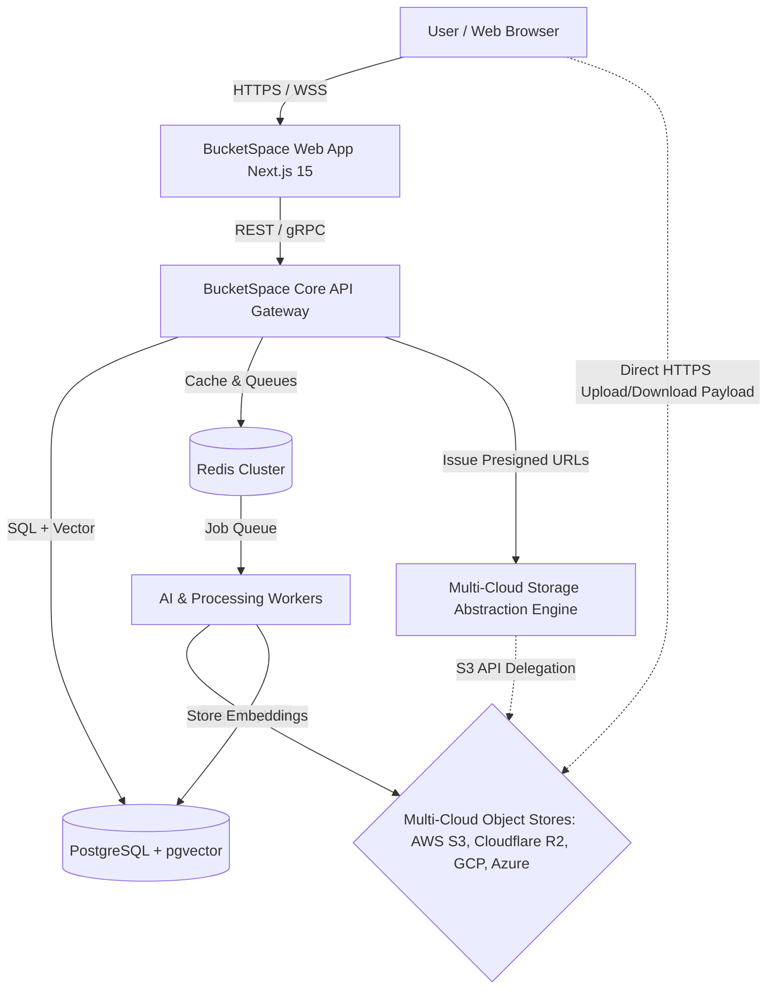
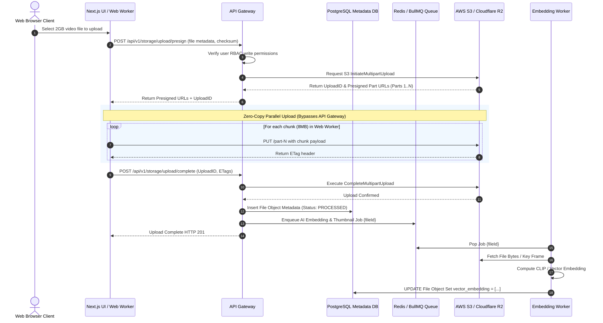

# System Architecture (04_SYSTEM_ARCHITECTURE.md)

## 1. Executive Summary & Architecture Goals
**BucketSpace** utilizes a modern, modular, cloud-native architecture optimized for zero-copy high-throughput file operations, sub-second vector search, and resilient multi-cloud orchestration.

### Core Architectural Goals
1. **Direct-to-Cloud Data Path**: Payload traffic bypasses application web servers via direct S3/R2 presigned URLs.
2. **ACID Metadata & Vector Unification**: Single PostgreSQL database with `pgvector` for metadata, authorization, and semantic embeddings.
3. **Decoupled Worker Processing**: Async job processing (BullMQ + Redis) for heavy media embedding, thumbnail generation, and multi-cloud sync.
4. **Real-Time Workspace Synchronization**: Event-driven WebSocket pub/sub bus broadcasting workspace state mutations.

---

## 2. C4 Architecture Diagrams

### C4 Level 1: System Context Diagram



### C4 Level 2: Container Diagram

```mermaid
graph TB
    subgraph Frontend Tier
        NextUI[Next.js 15 Web Workspace App]
        UploadWorker[Web Worker Chunked Uploader]
    end

    subgraph Backend Core Tier
        Gateway[Fastify / Express API Gateway]
        AuthService[AuthN / AuthZ Service (OAuth2 / RBAC)]
        StorageService[Storage Abstraction Service]
        SearchService[Hybrid Search Service (pgvector + Meilisearch)]
        SyncBus[WebSocket Real-Time Sync Server]
    end

    subgraph Asynchronous Worker Tier
        WorkerQueue[BullMQ Job Queue Engine]
        EmbeddingWorker[CLIP & Vector Embedding Worker]
        MediaWorker[Thumbnail & HLS Video Worker]
        SyncWorker[Bucket Replication & Mirror Worker]
    end

    subgraph Persistence & Infrastructure Tier
        PrimaryDB[(PostgreSQL 16 + pgvector)]
        CacheDB[(Redis 7.2 Cache & PubSub)]
        SearchDB[(Meilisearch Full-Text Index)]
        Vault[(HashiCorp Vault / KMS Secret Manager)]
    end

    NextUI --> Gateway
    NextUI --> SyncBus
    UploadWorker -.->|Presigned Multipart Payload| ExternalS3[External Cloud Buckets]

    Gateway --> AuthService
    Gateway --> StorageService
    Gateway --> SearchService
    Gateway --> PrimaryDB
    Gateway --> CacheDB

    StorageService --> Vault
    SearchService --> SearchDB
    SearchService --> PrimaryDB

    Gateway --> WorkerQueue
    WorkerQueue --> EmbeddingWorker
    WorkerQueue --> MediaWorker
    WorkerQueue --> SyncWorker

    EmbeddingWorker --> PrimaryDB
    MediaWorker --> ExternalS3
```

---

## 3. High-Level Communication & Execution Lifecycles

### Direct-to-Cloud Upload Request Lifecycle



---

## 4. Multi-Cloud Storage Abstraction Topology

To prevent cloud provider lock-in, all storage calls map to a unified `IStorageProvider` interface contract.

```typescript
export interface IStorageProvider {
  /** Issue presigned URL for GET file preview/download */
  getPresignedDownloadUrl(key: string, expiresInSeconds: number): Promise<string>;

  /** Issue presigned URLs for multi-part PUT upload */
  getPresignedUploadParts(
    key: string,
    fileSizeBytes: number,
    partSizeMB: number
  ): Promise<PresignedPartUrlsResponse>;

  /** Complete multipart upload on the provider */
  completeMultipartUpload(key: string, uploadId: string, parts: CompletedPart[]): Promise<void>;

  /** Native server-side copy within the provider */
  copyObject(sourceKey: string, destinationKey: string): Promise<void>;

  /** Hard delete object */
  deleteObject(key: string): Promise<void>;
}
```

---

## 5. Architectural Decisions & Engineering Reasoning

### ADR-004-1: Unified Node.js API Gateway with Fastify Core over Microservices Mesh
- **Decision**: Deploy a single modular monolith API Gateway using Fastify in Phase 1, rather than a distributed Kubernetes microservices mesh.
- **Reasoning**: Microservices at early stage add substantial DevOps overhead, network latency penalties, and deployment complexity without immediate scaling benefits.
- **Tradeoffs**: Requires strict internal module boundaries in folder structure (`/src/modules/storage`, `/src/modules/search`) to allow future extraction into standalone microservices.

---

## 6. Cross-References
- Tech Stack Justification: [05_TECH_STACK.md](file:///c:/Users/Vanrajsinh/Desktop/DevVault/Building-Hub/BucketSpace/context/05_TECH_STACK.md)
- Backend Architecture Deep Dive: [07_BACKEND_ARCHITECTURE.md](file:///c:/Users/Vanrajsinh/Desktop/DevVault/Building-Hub/BucketSpace/context/07_BACKEND_ARCHITECTURE.md)
- Storage Layer Details: [13_STORAGE_ARCHITECTURE.md](file:///c:/Users/Vanrajsinh/Desktop/DevVault/Building-Hub/BucketSpace/context/13_STORAGE_ARCHITECTURE.md)
