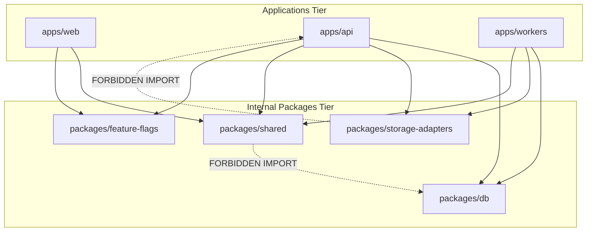

# Repository Structure & Codebase Architecture (06_REPOSITORY_STRUCTURE.md)

## 1. Executive Summary & Monorepo Layout
**BucketSpace** uses a clean, type-safe pnpm monorepo layout separating application entry points (`apps/`) from reusable core domain logic and database clients (`packages/`).

---

## 2. Directory Tree Map

```
BucketSpace/
├── apps/
│   ├── web/                         # Next.js 15 App Router Frontend
│   │   ├── src/
│   │   │   ├── app/                 # Next.js App Router Page Routes
│   │   │   │   ├── (auth)/          # Authentication Route Group
│   │   │   │   ├── (workspace)/     # Main Workspace Workspace UI
│   │   │   │   │   ├── buckets/     # Bucket Explorer Page
│   │   │   │   │   ├── search/      # Hybrid Search Page
│   │   │   │   │   └── settings/   # Workspace Settings Page
│   │   │   │   └── api/             # Next.js Edge Middleware / Auth Handlers
│   │   │   ├── components/          # React Components Layer
│   │   │   │   ├── ui/              # Primitives (Button, Dialog, Input)
│   │   │   │   ├── bucket/          # BucketTree, BucketHeader, QuotaBar
│   │   │   │   ├── file/            # FileGrid, FileCard, FileViewer, Dropzone
│   │   │   │   └── search/          # SearchBar, FilterPanel, VectorPreview
│   │   │   ├── hooks/               # Custom React Hooks
│   │   │   ├── stores/              # Zustand Client Stores
│   │   │   └── workers/             # Web Workers (Chunked Upload Thread)
│   ├── api/                         # Fastify Core API Gateway Application
│   │   ├── src/
│   │   │   ├── modules/             # Modular Domain Business Modules
│   │   │   │   ├── auth/            # Auth Controller, Service, DTOs
│   │   │   │   ├── bucket/          # Bucket Management Logic
│   │   │   │   ├── file/            # File Metadata & Presigning Logic
│   │   │   │   ├── search/          # Hybrid Vector Search Handler
│   │   │   │   └── sync/            # WebSocket Realtime Event Bus
│   │   │   ├── middleware/          # Auth, CORS, Logging, Error Boundaries
│   │   │   └── server.ts            # Fastify App Initialization
│   └── workers/                     # Background Asynchronous Workers
│       ├── src/
│       │   ├── jobs/                # BullMQ Job Handlers
│       │   │   ├── embedding.job.ts # CLIP/Whisper Vector Embedding Worker
│       │   │   ├── thumbnail.job.ts # Video & Image Thumbnail Generator
│       │   │   └── sync.job.ts      # Multi-Cloud Bucket Replication Worker
│       │   └── worker.ts            # Worker Process Entry Point
├── packages/
│   ├── db/                          # Prisma ORM & Database Schemas
│   │   ├── prisma/
│   │   │   ├── schema.prisma        # Master Database Schema Definition
│   │   │   └── migrations/          # SQL Migration Scripts
│   │   └── src/                     # Exported Prisma Client & Type Helpers
│   ├── storage-adapters/            # Multi-Cloud Storage SDK Drivers
│   │   ├── src/
│   │   │   ├── provider.interface.ts # Universal IStorageProvider Contract
│   │   │   ├── s3.adapter.ts        # AWS S3 Storage Adapter
│   │   │   ├── r2.adapter.ts        # Cloudflare R2 Adapter
│   │   │   └── gcs.adapter.ts       # Google Cloud Storage Adapter
│   ├── shared/                      # Shared Types, DTOs, Zod Schemas & Constants
│   │   └── src/
│   │       ├── schemas/             # Zod Validation Contracts
│   │       ├── types/               # TypeScript Interfaces
│   │       └── constants/           # Enums & Status Error Codes
│   └── feature-flags/               # Feature Flag Gatekeeping Module
├── context/                         # Single Source of Truth Context Hub
├── scripts/                         # DevOps & Seed Scripts
└── pnpm-workspace.yaml              # Monorepo Workspace Config
```

---

## 3. Module Isolation & Dependency Rules



### Strict Import Guardrails
1. `packages/shared` MUST NOT import from `@bucketspace/db`, `apps/api`, or `apps/web`. It must remain pure runtime-agnostic TypeScript.
2. `apps/web` MUST NOT import `@bucketspace/db` or Node.js server drivers directly; all database interaction must go through HTTP/WSS APIs.
3. Cross-module imports within `apps/api/src/modules/` MUST use public module exports (`index.ts`) and avoid deep file path imports.

---

## 4. File Naming Conventions

| Component Type | Naming Convention | Example |
|---|---|---|
| **React Components** | PascalCase `.tsx` | `FileCard.tsx`, `BucketTree.tsx` |
| **Custom Hooks** | camelCase `use` prefix `.ts` | `useDirectUpload.ts`, `useBucketTree.ts` |
| **API Modules** | kebab-case folder + `.controller.ts`, `.service.ts` | `file.controller.ts`, `file.service.ts` |
| **Zod Schemas** | PascalCase schema export in kebab-case `.schema.ts` | `upload.schema.ts` (`UploadPresignSchema`) |
| **Database Models** | PascalCase singular | `FileObject`, `Workspace`, `Bucket` |

---

## 5. Cross-References
- Tech Stack Specs: [05_TECH_STACK.md](file:///c:/Users/Vanrajsinh/Desktop/DevVault/Building-Hub/BucketSpace/context/05_TECH_STACK.md)
- Backend Architecture: [07_BACKEND_ARCHITECTURE.md](file:///c:/Users/Vanrajsinh/Desktop/DevVault/Building-Hub/BucketSpace/context/07_BACKEND_ARCHITECTURE.md)
- Frontend Architecture: [08_FRONTEND_ARCHITECTURE.md](file:///c:/Users/Vanrajsinh/Desktop/DevVault/Building-Hub/BucketSpace/context/08_FRONTEND_ARCHITECTURE.md)
