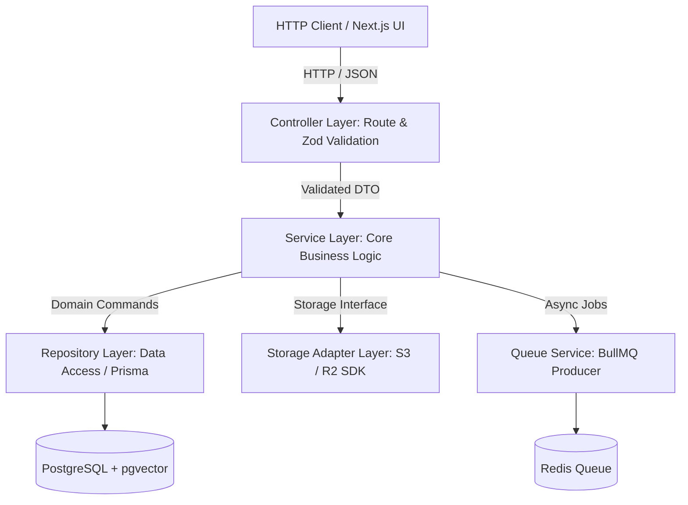
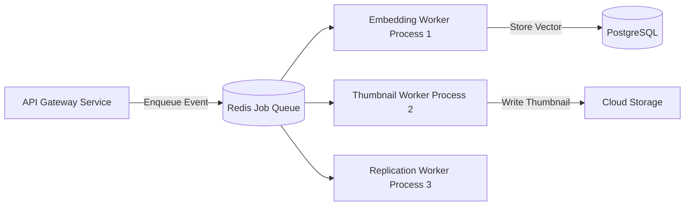

# Backend Architecture (07_BACKEND_ARCHITECTURE.md)

## 1. Architecture Overview & Design Goals
The **BucketSpace Backend** (`apps/api`) is structured as a high-performance, modular API Gateway built on **Fastify** and **TypeScript**. It handles request routing, authorization, metadata storage, presigned URL issuance, search indexing, and job queue orchestration.

---

## 2. Layered Architecture Pattern



### Layer Responsibilities
1. **Controller Layer (`*.controller.ts`)**: Decodes HTTP requests, executes Zod schema validation, extracts user auth token context, and returns standard HTTP responses. Zero business logic.
2. **Service Layer (`*.service.ts`)**: Implements pure domain business rules, coordinates transactions, invokes storage adapters, and triggers background jobs.
3. **Repository Layer (`*.repository.ts`)**: Encapsulates Prisma database queries, vector similarity operations, and caching policies.
4. **Storage Adapter Layer (`packages/storage-adapters`)**: Encapsulates provider-specific S3/R2 API credentials and presigned URL cryptographic signing.

---

## 3. Background Job Queue Architecture (BullMQ)



### Standard Job Interface Contract

```typescript
export interface BaseJobPayload {
  jobId: string;
  workspaceId: string;
  userId: string;
  timestamp: string;
  traceId: string;
}

export interface FileEmbeddingJobPayload extends BaseJobPayload {
  fileId: string;
  s3Key: string;
  bucketId: string;
  mimeType: string;
}
```

---

## 4. Error Handling & Request Lifecycle Hooks

```typescript
// Fastify Global Error Handler & W3C Trace Injection
import { FastifyInstance } from 'fastify';
import { v4 as uuidv4 } from 'uuid';

export function setupBackendHooks(fastify: FastifyInstance) {
  // Inject Trace ID on incoming request
  fastify.addHook('onRequest', async (req, reply) => {
    req.headers['x-trace-id'] = (req.headers['x-trace-id'] as string) || uuidv4();
    reply.header('x-trace-id', req.headers['x-trace-id']);
  });

  // Global Centralized Error Boundary
  fastify.setErrorHandler((error, req, reply) => {
    const traceId = req.headers['x-trace-id'];
    req.log.error({ err: error, traceId }, 'Unhandled Exception');

    if (error.validation) {
      return reply.status(400).send({
        statusCode: 400,
        errorCode: 'VALIDATION_ERROR',
        message: 'Invalid request payload format',
        details: error.validation,
        traceId,
      });
    }

    return reply.status(error.statusCode || 500).send({
      statusCode: error.statusCode || 500,
      errorCode: error.code || 'INTERNAL_SERVER_ERROR',
      message: error.message || 'An unexpected backend error occurred',
      traceId,
    });
  });
}
```

---

## 5. Cross-References
- API Specification Details: [10_API_SPECIFICATION.md](file:///c:/Users/Vanrajsinh/Desktop/DevVault/Building-Hub/BucketSpace/context/10_API_SPECIFICATION.md)
- Storage Engine Mechanics: [13_STORAGE_ARCHITECTURE.md](file:///c:/Users/Vanrajsinh/Desktop/DevVault/Building-Hub/BucketSpace/context/13_STORAGE_ARCHITECTURE.md)
- Error Taxonomy Standard: [21_ERROR_HANDLING.md](file:///c:/Users/Vanrajsinh/Desktop/DevVault/Building-Hub/BucketSpace/context/21_ERROR_HANDLING.md)
