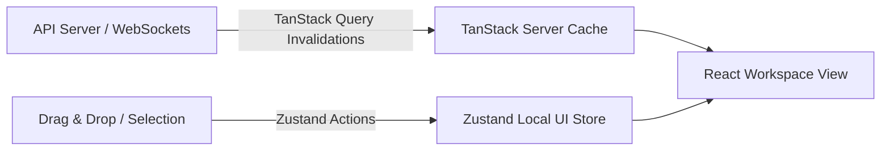

# Frontend Architecture (08_FRONTEND_ARCHITECTURE.md)

## 1. Architecture Overview & Principles
The **BucketSpace Frontend** (`apps/web`) is built using **Next.js 15 App Router**, **React 19**, **Tailwind CSS**, and **Zustand**. It provides a high-performance visual workspace capable of handling directory trees with 100,000+ objects without DOM freezing or memory leaks.

---

## 2. Next.js 15 Component Boundary Strategy

```mermaid
graph TD
    subgraph Server Component Tier (Zero Client JS)
        Layout[app/layout.tsx] --> AuthGuard[app/(workspace)/layout.tsx]
        AuthGuard --> BucketTreeFetcher[components/bucket/BucketTreeServer.tsx]
        AuthGuard --> FileMetadataFetcher[components/file/FileGridServer.tsx]
    end

    subgraph Client Interactive Tier ('use client')
        BucketTreeFetcher --> BucketTreeClient[components/bucket/BucketTreeClient.tsx]
        FileMetadataFetcher --> FileGridClient[components/file/FileGridClient.tsx]
        FileGridClient --> FileViewerModal[components/file/FileViewerModal.tsx]
        FileGridClient --> UploadDropzone[components/file/UploadDropzone.tsx]
        UploadDropzone --> UploadWorkerThread[workers/upload.worker.ts]
    end
```

### Component Rules
- **Server Components (Default)**: Fetch initial workspace directory data directly via API endpoints and pass frozen metadata props down to interactive components.
- **Client Components (`'use client'`)**: Isolated strictly to interactive UI trees requiring local state, drag-and-drop event listeners, or WebSocket event subscriptions.

---

## 3. Web Worker Parallel Chunked Upload Pipeline

To maintain 60fps UI responsiveness during massive multi-gigabyte file uploads, payload hashing and network PUT requests execute inside dedicated Web Workers off the main browser UI thread.

```typescript
// Web Worker Implementation (src/workers/upload.worker.ts)
export interface UploadChunkMessage {
  chunkIndex: number;
  blob: Blob;
  presignedUrl: string;
}

self.onmessage = async (event: MessageEvent<UploadChunkMessage>) => {
  const { chunkIndex, blob, presignedUrl } = event.data;

  try {
    const response = await fetch(presignedUrl, {
      method: 'PUT',
      body: blob,
      headers: {
        'Content-Type': 'application/octet-stream',
      },
    });

    if (!response.ok) {
      throw new Error(`Part ${chunkIndex} failed with HTTP ${response.status}`);
    }

    const etag = response.headers.get('ETag');
    self.postMessage({ status: 'SUCCESS', chunkIndex, etag });
  } catch (err) {
    self.postMessage({ status: 'ERROR', chunkIndex, error: (err as Error).message });
  }
};
```

---

## 4. State Management Architecture



1. **Server State (TanStack Query v5)**: Manages async directory listings, search query results, bucket metadata, and presigned URLs with automatic staleduring-revalidation (`staleTime: 30000`).
2. **Client UI State (Zustand v4)**: Manages active selected file IDs, drag selection bounding box coordinates, active preview modal state, and theme settings.

---

## 5. Performance Budgets

| Metric | Target Budget | Enforcement Mechanism |
|---|---|---|
| **First Contentful Paint (FCP)** | `< 0.8s` | Server Components + Edge CDN caching. |
| **Interaction to Next Paint (INP)** | `< 50ms` | Web Worker upload offloading + virtualized grid rendering. |
| **Initial JS Bundle Size** | `< 120 KB gzipped` | Next.js dynamic imports (`next/dynamic`) for heavy previewers (PDF, 3D Canvas). |

---

## 6. Cross-References
- Design System Tokens: [18_DESIGN_SYSTEM.md](file:///c:/Users/Vanrajsinh/Desktop/DevVault/Building-Hub/BucketSpace/context/18_DESIGN_SYSTEM.md)
- Component Library Specs: [19_COMPONENT_LIBRARY.md](file:///c:/Users/Vanrajsinh/Desktop/DevVault/Building-Hub/BucketSpace/context/19_COMPONENT_LIBRARY.md)
- Client State Management: [16_STATE_MANAGEMENT.md](file:///c:/Users/Vanrajsinh/Desktop/DevVault/Building-Hub/BucketSpace/context/16_STATE_MANAGEMENT.md)
