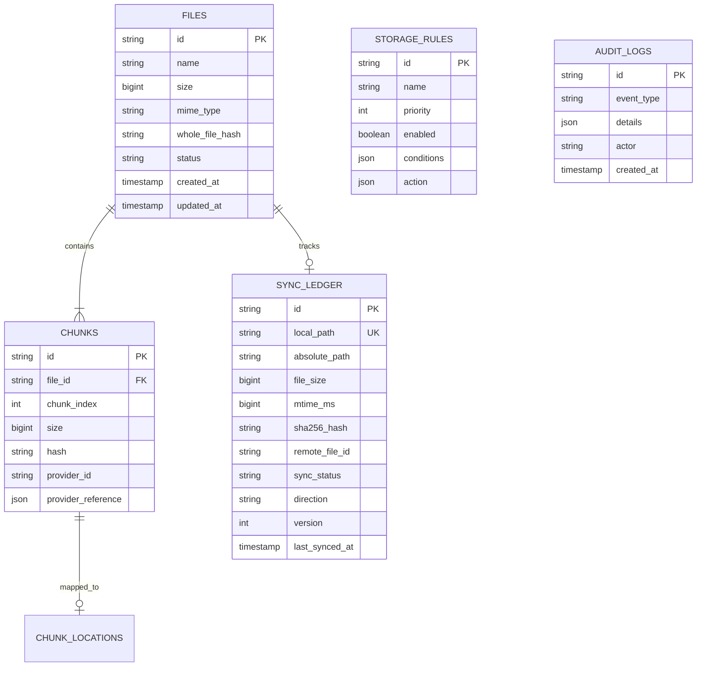

# Database Schema Specification (09_DATABASE.md)

## 1. Executive Summary & ERD Overview
**BucketSpace** uses an embedded SQLite database engine (`node:sqlite` / `better-sqlite3`) configured with Write-Ahead Logging (`PRAGMA journal_mode = WAL;`) and Foreign Key enforcement (`PRAGMA foreign_keys = ON;`). It maintains relational indices for files, chunks, routing rules, audit logs, and the folder synchronization state ledger.

---

## 2. Entity Relationship Diagram (ERD)



---

## 3. SQLite DDL Schema

```sql
CREATE TABLE IF NOT EXISTS files (
  id TEXT PRIMARY KEY,
  name TEXT NOT NULL,
  size INTEGER NOT NULL,
  mime_type TEXT NOT NULL,
  whole_file_hash TEXT NOT NULL,
  status TEXT NOT NULL DEFAULT 'ACTIVE',
  created_at TEXT NOT NULL,
  updated_at TEXT NOT NULL
);

CREATE TABLE IF NOT EXISTS chunks (
  id TEXT PRIMARY KEY,
  file_id TEXT NOT NULL,
  chunk_index INTEGER NOT NULL,
  size INTEGER NOT NULL,
  hash TEXT NOT NULL,
  provider_id TEXT,
  provider_reference TEXT,
  created_at TEXT NOT NULL DEFAULT CURRENT_TIMESTAMP,
  FOREIGN KEY (file_id) REFERENCES files(id) ON DELETE CASCADE,
  CONSTRAINT uq_file_chunk UNIQUE (file_id, chunk_index)
);

CREATE TABLE IF NOT EXISTS chunk_locations (
  chunk_id TEXT NOT NULL,
  provider_id TEXT NOT NULL,
  provider_ref TEXT NOT NULL,
  is_primary INTEGER NOT NULL DEFAULT 1,
  verified_at TEXT NOT NULL DEFAULT CURRENT_TIMESTAMP,
  PRIMARY KEY (chunk_id, provider_id),
  FOREIGN KEY (chunk_id) REFERENCES chunks(id) ON DELETE CASCADE
);

CREATE TABLE IF NOT EXISTS storage_rules (
  id TEXT PRIMARY KEY,
  name TEXT NOT NULL,
  priority INTEGER NOT NULL DEFAULT 0,
  enabled INTEGER NOT NULL DEFAULT 1,
  conditions TEXT NOT NULL,
  action TEXT NOT NULL,
  created_at TEXT NOT NULL,
  updated_at TEXT NOT NULL
);

CREATE TABLE IF NOT EXISTS audit_logs (
  id TEXT PRIMARY KEY,
  event_type TEXT NOT NULL,
  details TEXT NOT NULL,
  actor TEXT NOT NULL DEFAULT 'SYSTEM',
  created_at TEXT NOT NULL
);

CREATE TABLE IF NOT EXISTS sync_ledger (
  id TEXT PRIMARY KEY,
  local_path TEXT NOT NULL UNIQUE,
  absolute_path TEXT NOT NULL,
  file_size INTEGER NOT NULL,
  mtime_ms INTEGER NOT NULL,
  sha256_hash TEXT NOT NULL,
  remote_file_id TEXT,
  sync_status TEXT NOT NULL DEFAULT 'PENDING_UPLOAD',
  direction TEXT NOT NULL DEFAULT 'IDLE',
  version INTEGER NOT NULL DEFAULT 1,
  retry_count INTEGER NOT NULL DEFAULT 0,
  error_message TEXT,
  is_deleted INTEGER NOT NULL DEFAULT 0,
  last_synced_at TEXT,
  created_at TEXT NOT NULL DEFAULT CURRENT_TIMESTAMP,
  updated_at TEXT NOT NULL DEFAULT CURRENT_TIMESTAMP
);
---

## 4. Cross-References
- System Architecture: [04_SYSTEM_ARCHITECTURE.md](file:///c:/Users/Vanrajsinh/Desktop/DevVault/Building-Hub/BucketSpace/context/04_SYSTEM_ARCHITECTURE.md)
- Storage Architecture: [13_STORAGE_ARCHITECTURE.md](file:///c:/Users/Vanrajsinh/Desktop/DevVault/Building-Hub/BucketSpace/context/13_STORAGE_ARCHITECTURE.md)
- Domain Models: [11_DOMAIN_MODELS.md](file:///c:/Users/Vanrajsinh/Desktop/DevVault/Building-Hub/BucketSpace/context/11_DOMAIN_MODELS.md)
- Vector Search Architecture: [14_SEARCH_ARCHITECTURE.md](file:///c:/Users/Vanrajsinh/Desktop/DevVault/Building-Hub/BucketSpace/context/14_SEARCH_ARCHITECTURE.md)
- Domain Models & DDD Aggregates: [11_DOMAIN_MODELS.md](file:///c:/Users/Vanrajsinh/Desktop/DevVault/Building-Hub/BucketSpace/context/11_DOMAIN_MODELS.md)
