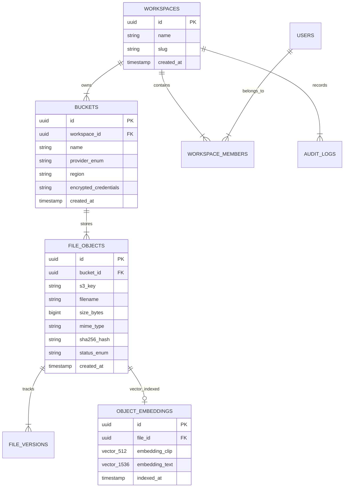

# Database & Vector Schema (09_DATABASE.md)

## 1. Executive Summary & ERD Overview
**BucketSpace** uses a single PostgreSQL 16 database with the `pgvector` extension to unify relational workspace metadata, access control policies, file object metadata, audit trails, and 512/1536-dimensional AI vector embeddings.

---

## 2. Entity Relationship Diagram (ERD)



---

## 3. Complete Prisma Schema Specification

```prisma
// packages/db/prisma/schema.prisma

datasource db {
  provider   = "postgresql"
  url        = env("DATABASE_URL")
  extensions = [pgvector(map: "vector")]
}

generator client {
  provider        = "prisma-client-js"
  previewFeatures = ["postgresqlExtensions"]
}

enum ProviderType {
  AWS_S3
  CLOUDFLARE_R2
  GCP_STORAGE
  AZURE_BLOB
  MINIO
}

enum ObjectStatus {
  PENDING_UPLOAD
  PROCESSED
  QUARANTINED
  DELETED
}

enum Role {
  OWNER
  ADMIN
  EDITOR
  VIEWER
}

model Workspace {
  id        String   @id @default(uuid()) @db.Uuid
  name      String   @db.VarChar(255)
  slug      String   @unique @db.VarChar(255)
  createdAt DateTime @default(now()) @map("created_at")
  updatedAt DateTime @updatedAt @map("updated_at")

  buckets   Bucket[]
  members   WorkspaceMember[]
  auditLogs AuditLog[]

  @@map("workspaces")
}

model User {
  id        String   @id @default(uuid()) @db.Uuid
  email     String   @unique @db.VarChar(255)
  name      String   @db.VarChar(255)
  avatarUrl String?  @map("avatar_url")
  createdAt DateTime @default(now()) @map("created_at")

  memberships WorkspaceMember[]

  @@map("users")
}

model WorkspaceMember {
  id          String   @id @default(uuid()) @db.Uuid
  workspaceId String   @map("workspace_id") @db.Uuid
  userId      String   @map("user_id") @db.Uuid
  role        Role     @default(VIEWER)
  createdAt   DateTime @default(now()) @map("created_at")

  workspace Workspace @relation(fields: [workspaceId], references: [id], onDelete: Cascade)
  user      User      @relation(fields: [userId], references: [id], onDelete: Cascade)

  @@unique([workspaceId, userId])
  @@map("workspace_members")
}

model Bucket {
  id                   String       @id @default(uuid()) @db.Uuid
  workspaceId          String       @map("workspace_id") @db.Uuid
  name                 String       @db.VarChar(255)
  provider             ProviderType
  region               String       @db.VarChar(100)
  endpoint             String?      @db.VarChar(512)
  encryptedCredentials String       @map("encrypted_credentials") @db.Text
  createdAt            DateTime     @default(now()) @map("created_at")

  workspace Workspace  @relation(fields: [workspaceId], references: [id], onDelete: Cascade)
  files     FileObject[]

  @@unique([workspaceId, name])
  @@map("buckets")
}

model FileObject {
  id         String       @id @default(uuid()) @db.Uuid
  bucketId   String       @map("bucket_id") @db.Uuid
  s3Key      String       @map("s3_key") @db.VarChar(1024)
  filename   String       @db.VarChar(512)
  sizeBytes  BigInt       @map("size_bytes")
  mimeType   String       @map("mime_type") @db.VarChar(255)
  sha256Hash String?      @map("sha256_hash") @db.Char(64)
  status     ObjectStatus @default(PENDING_UPLOAD)
  createdAt  DateTime     @default(now()) @map("created_at")
  updatedAt  DateTime     @updatedAt @map("updated_at")

  bucket    Bucket           @relation(fields: [bucketId], references: [id], onDelete: Cascade)
  embedding ObjectEmbedding?

  @@index([bucketId, s3Key])
  @@index([bucketId, filename])
  @@index([status])
  @@map("file_objects")
}

model ObjectEmbedding {
  id            String                      @id @default(uuid()) @db.Uuid
  fileId        String                      @unique @map("file_id") @db.Uuid
  embeddingClip Unsupported("vector(512)")? @map("embedding_clip")
  embeddingText Unsupported("vector(1536)")?@map("embedding_text")
  indexedAt     DateTime                    @default(now()) @map("indexed_at")

  file FileObject @relation(fields: [fileId], references: [id], onDelete: Cascade)

  @@map("object_embeddings")
}

model AuditLog {
  id          String   @id @default(uuid()) @db.Uuid
  workspaceId String   @map("workspace_id") @db.Uuid
  actorUserId String   @map("actor_user_id") @db.Uuid
  action      String   @db.VarChar(100)
  resource    String   @db.VarChar(512)
  ipAddress   String   @map("ip_address") @db.VarChar(45)
  metadata    Json     @default("{}")
  createdAt   DateTime @default(now()) @map("created_at")

  workspace Workspace @relation(fields: [workspaceId], references: [id], onDelete: Cascade)

  @@index([workspaceId, createdAt])
  @@map("audit_logs")
}
```

---

## 4. Vector Search HNSW Index Strategy

To ensure sub-50ms cosine similarity vector search over millions of object embeddings, PostgreSQL DDL migrations apply dedicated HNSW indexes:

```sql
-- DDL Migration Script for HNSW Vector Indexes
CREATE INDEX IF NOT EXISTS idx_object_embeddings_clip_hnsw
ON object_embeddings USING hnsw (embedding_clip vector_cosine_ops)
WITH (m = 16, ef_construction = 64);

CREATE INDEX IF NOT EXISTS idx_object_embeddings_text_hnsw
ON object_embeddings USING hnsw (embedding_text vector_cosine_ops)
WITH (m = 16, ef_construction = 64);
```

---

## 5. Cross-References
- API Models & Schemas: [10_API_SPECIFICATION.md](file:///c:/Users/Vanrajsinh/Desktop/DevVault/Building-Hub/BucketSpace/context/10_API_SPECIFICATION.md)
- Vector Search Architecture: [14_SEARCH_ARCHITECTURE.md](file:///c:/Users/Vanrajsinh/Desktop/DevVault/Building-Hub/BucketSpace/context/14_SEARCH_ARCHITECTURE.md)
- Domain Models & DDD Aggregates: [11_DOMAIN_MODELS.md](file:///c:/Users/Vanrajsinh/Desktop/DevVault/Building-Hub/BucketSpace/context/11_DOMAIN_MODELS.md)
