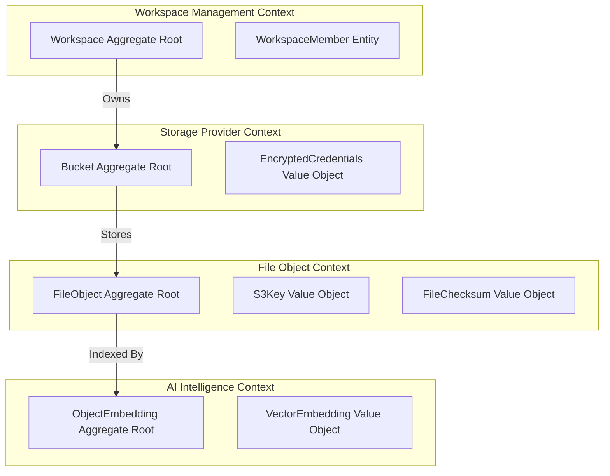

# Domain Models & Domain-Driven Design (11_DOMAIN_MODELS.md)

## 1. Executive Summary & Bounded Context Map
**BucketSpace** applies strict **Domain-Driven Design (DDD)** principles to separate core business capabilities into isolated, cohesive bounded contexts.



---

## 2. Aggregates & Domain Entities

### 2.1 FileObject Aggregate Root

```typescript
// Domain Entity: FileObject Aggregate Root
export class FileObject {
  private constructor(
    private readonly _id: string,
    private readonly _bucketId: string,
    private _s3Key: S3Key,
    private _filename: string,
    private _sizeBytes: number,
    private _mimeType: string,
    private _checksum: FileChecksum | null,
    private _status: ObjectStatus,
    private readonly _createdAt: Date
  ) {}

  public static createPending(props: {
    bucketId: string;
    rawKey: string;
    filename: string;
    sizeBytes: number;
    mimeType: string;
  }): FileObject {
    return new FileObject(
      crypto.randomUUID(),
      props.bucketId,
      S3Key.create(props.rawKey),
      props.filename,
      props.sizeBytes,
      props.mimeType,
      null,
      ObjectStatus.PENDING_UPLOAD,
      new Date()
    );
  }

  public markProcessed(checksum: string): void {
    if (this._status !== ObjectStatus.PENDING_UPLOAD) {
      throw new DomainError('Cannot mark file processed unless status is PENDING_UPLOAD');
    }
    this._checksum = FileChecksum.create(checksum);
    this._status = ObjectStatus.PROCESSED;
  }

  // Getters
  public get id(): string { return this._id; }
  public get status(): ObjectStatus { return this._status; }
  public get s3Key(): S3Key { return this._s3Key; }
}
```

---

## 3. Value Objects

```typescript
// Value Object: S3Key
export class S3Key {
  private readonly _value: string;

  private constructor(value: string) {
    this._value = value;
  }

  public static create(rawKey: string): S3Key {
    const sanitized = rawKey.trim().replace(/^\/+/, '');
    if (!sanitized || sanitized.length > 1024) {
      throw new DomainError('Invalid S3 Key length');
    }
    return new S3Key(sanitized);
  }

  public get value(): string { return this._value; }
  public get extension(): string {
    const parts = this._value.split('.');
    return parts.length > 1 ? parts.pop()!.toLowerCase() : '';
  }
}
```

---

## 4. Domain Events

Domain events represent immutable state mutations broadcast across the system.

```typescript
export interface DomainEvent {
  eventId: string;
  eventType: string;
  occurredAt: Date;
  aggregateId: string;
}

export interface FileUploadedDomainEvent extends DomainEvent {
  eventType: 'FILE_UPLOADED';
  bucketId: string;
  workspaceId: string;
  s3Key: string;
  mimeType: string;
  sizeBytes: number;
}
```

---

## 5. Cross-References
- Database Schema Mapping: [09_DATABASE.md](file:///c:/Users/Vanrajsinh/Desktop/DevVault/Building-Hub/BucketSpace/context/09_DATABASE.md)
- Backend Architecture Layers: [07_BACKEND_ARCHITECTURE.md](file:///c:/Users/Vanrajsinh/Desktop/DevVault/Building-Hub/BucketSpace/context/07_BACKEND_ARCHITECTURE.md)
- Event Bus Synchronization: [15_SYNC_ARCHITECTURE.md](file:///c:/Users/Vanrajsinh/Desktop/DevVault/Building-Hub/BucketSpace/context/15_SYNC_ARCHITECTURE.md)
