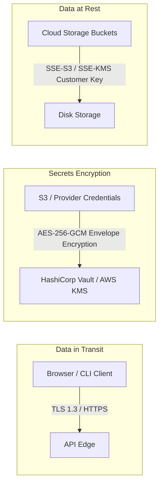

# Authorization & Security Architecture (12_AUTHORIZATION_SECURITY.md)

## 1. Executive Summary & Security Philosophy
**BucketSpace** enforces a **Zero-Trust Security Model**. Every API request, presigned URL token, bucket credential, and vector query is authenticated, authorized, and cryptographically verified. No implicit trust is granted based on network location.

---

## 2. Authentication & JWT Architecture

```mermaid
graph TD
    User[User Client] -->|1. Auth Request| OAuth[OAuth2 / OIDC Provider (GitHub / Google / Okta)]
    OAuth -->|2. Authorization Code| AuthServer[BucketSpace Auth Service]
    AuthServer -->|3. Issue RS256 JWT Token| User
    User -->|4. Bearer JWT Header| Gateway[API Gateway Middleware]
    Gateway -->|5. Verify Public Key Signature| Validated[Grant Scope Access]
```

### JWT Token Claims Structure
```json
{
  "iss": "https://auth.bucketspace.io",
  "sub": "usr_998877665544332211",
  "email": "engineer@studio.com",
  "workspaceId": "ws_123456789",
  "role": "ADMIN",
  "iat": 1785834000,
  "exp": 1785837600
}
```

---

## 3. Fine-Grained Authorization Matrix (RBAC + ABAC)

| Resource | Operation | OWNER | ADMIN | EDITOR | VIEWER |
|---|---|---|---|---|---|
| **Workspace Settings** | Delete Workspace | Yes | No | No | No |
| **Bucket Credentials** | Add / Edit S3 Keys | Yes | Yes | No | No |
| **Object Files** | Presign Upload / Write | Yes | Yes | Yes | No |
| **Object Files** | Read / Presign Download | Yes | Yes | Yes | Yes |
| **Vector Search** | Query Vector Index | Yes | Yes | Yes | Yes |
| **Audit Logs** | Export Audit Trail | Yes | Yes | No | No |

---

## 4. Encryption Architecture



### Envelope Encryption Algorithm for Provider Credentials
Cloud bucket access keys stored in PostgreSQL `buckets.encrypted_credentials` are encrypted using AES-256-GCM envelope encryption with master keys sourced from HashiCorp Vault or AWS KMS.

---

## 5. Cross-References
- API Specification Details: [10_API_SPECIFICATION.md](file:///c:/Users/Vanrajsinh/Desktop/DevVault/Building-Hub/BucketSpace/context/10_API_SPECIFICATION.md)
- Storage Presigned Security: [13_STORAGE_ARCHITECTURE.md](file:///c:/Users/Vanrajsinh/Desktop/DevVault/Building-Hub/BucketSpace/context/13_STORAGE_ARCHITECTURE.md)
- Audit Logging Standard: [22_LOGGING.md](file:///c:/Users/Vanrajsinh/Desktop/DevVault/Building-Hub/BucketSpace/context/22_LOGGING.md)
