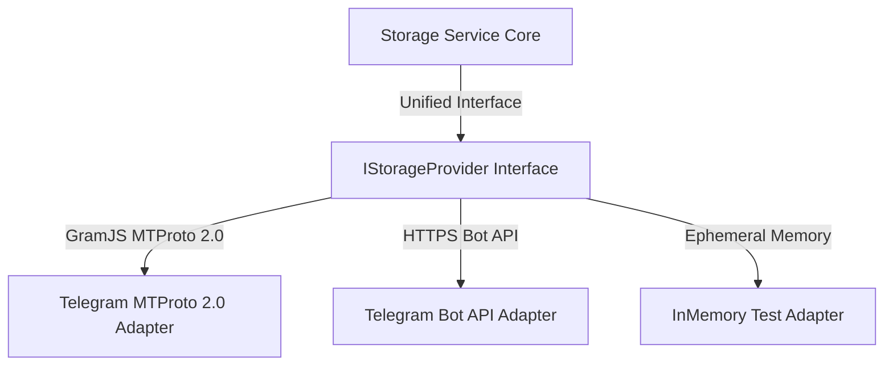
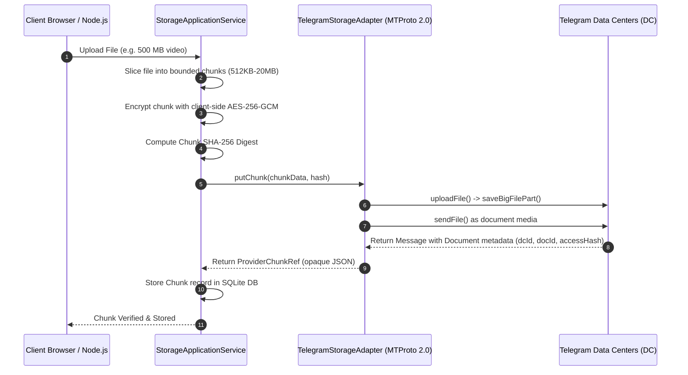

# Telegram Cloud Storage Architecture (13_STORAGE_ARCHITECTURE.md)

## 1. Executive Summary & Design Goals
The **BucketSpace Storage Engine** (`packages/storage-adapters`) implements Telegram cloud storage as the dedicated storage backend via `IStorageProvider`, supporting native MTProto 2.0 streaming and Bot API fallbacks.

---

## 2. Storage Provider Topology



---

## 3. MTProto 2.0 Streaming Chunk Ingestion Workflow



---

## 4. SHA-256 Integrity & Deduplication Invariant

Every chunk uploaded to Telegram is validated against its SHA-256 hash before storage, during download streaming, and upon final reassembly:

```typescript
export function verifyChunkIntegrity(
  downloadedBytes: Uint8Array,
  expectedHash: string
): boolean {
  const actualHash = createHash('sha256').update(downloadedBytes).digest('hex');
  return actualHash === expectedHash;
}
```

---

## 5. Cross-References
- System Architecture: [04_SYSTEM_ARCHITECTURE.md](file:///c:/Users/Vanrajsinh/Desktop/DevVault/Building-Hub/BucketSpace/context/04_SYSTEM_ARCHITECTURE.md)
- Database Schema: [09_DATABASE.md](file:///c:/Users/Vanrajsinh/Desktop/DevVault/Building-Hub/BucketSpace/context/09_DATABASE.md)
- Telegram Credentials Guide: [TELEGRAM_CREDENTIALS_GUIDE.md](file:///c:/Users/Vanrajsinh/Desktop/DevVault/Building-Hub/BucketSpace/context/TELEGRAM_CREDENTIALS_GUIDE.md)

