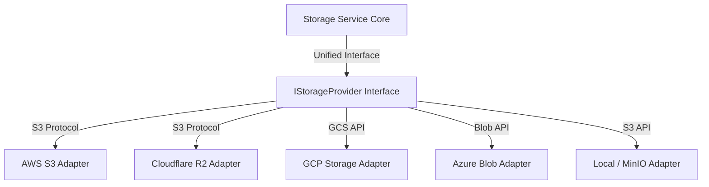
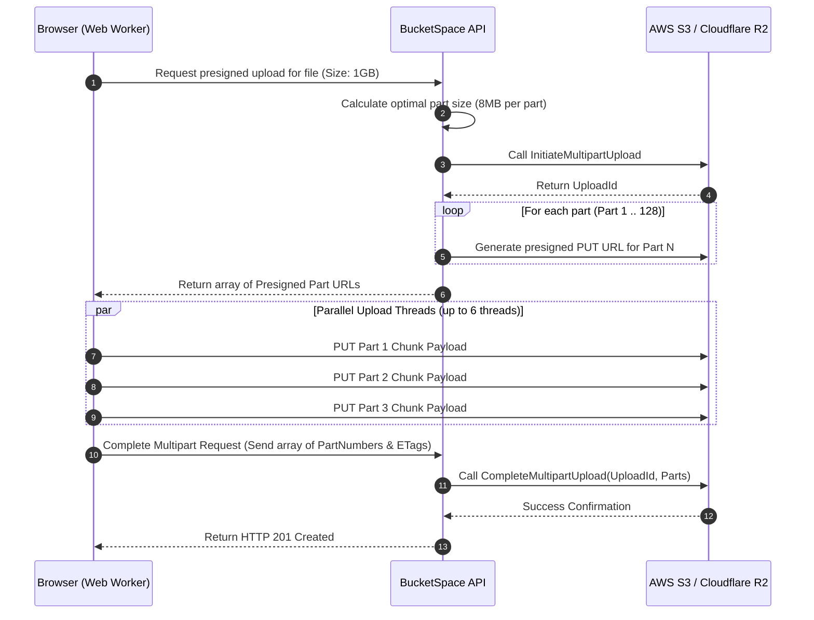

# Multi-Cloud Storage Architecture (13_STORAGE_ARCHITECTURE.md)

## 1. Executive Summary & Design Goals
The **BucketSpace Storage Engine** (`packages/storage-adapters`) abstracts multi-cloud object storage engines into a single unified driver interface (`IStorageProvider`).

---

## 2. Multi-Cloud Provider Abstraction Engine



---

## 3. Presigned Multipart Upload Workflow



---

## 4. SHA-256 Deduplication & Deduplication Engine

Before uploading any file larger than 1MB, the client Web Worker computes the SHA-256 hash of the file payload.

```typescript
export async function checkDeduplication(
  workspaceId: string,
  sha256Hash: string
): Promise<{ isDuplicate: boolean; existingFileId?: string }> {
  const existing = await prisma.fileObject.findFirst({
    where: {
      bucket: { workspaceId },
      sha256Hash,
      status: 'PROCESSED',
    },
  });

  if (existing) {
    return { isDuplicate: true, existingFileId: existing.id };
  }
  return { isDuplicate: false };
}
```

If a duplicate file payload is detected within the workspace, the system creates a zero-copy pointer metadata entry without re-uploading duplicate bytes to cloud storage.

---

## 5. Cross-References
- API Presign Endpoints: [10_API_SPECIFICATION.md](file:///c:/Users/Vanrajsinh/Desktop/DevVault/Building-Hub/BucketSpace/context/10_API_SPECIFICATION.md)
- Web Worker Upload Engine: [08_FRONTEND_ARCHITECTURE.md](file:///c:/Users/Vanrajsinh/Desktop/DevVault/Building-Hub/BucketSpace/context/08_FRONTEND_ARCHITECTURE.md)
- Security & Encryption: [12_AUTHORIZATION_SECURITY.md](file:///c:/Users/Vanrajsinh/Desktop/DevVault/Building-Hub/BucketSpace/context/12_AUTHORIZATION_SECURITY.md)
