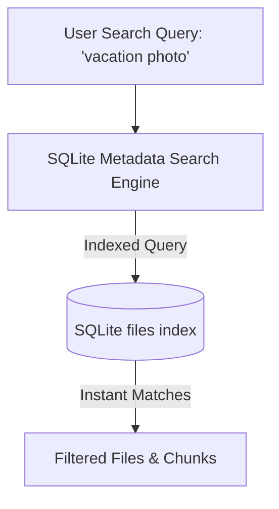

# Search Architecture (14_SEARCH_ARCHITECTURE.md)

## 1. Executive Summary & Design Goals
**BucketSpace** features an instant, deterministic SQLite search engine indexing files by name, MIME type, extension, size, and status with sub-millisecond query latency.

---

## 2. Search System Architecture



---

## 3. SQLite Search Implementation

```typescript
export async function searchFiles(
  db: DatabaseSync,
  query: string,
  options?: { limit?: number; offset?: number }
): Promise<FileMetadata[]> {
  const searchTerm = `%${query.trim()}%`;
  const stmt = db.prepare(`
    SELECT * FROM files
    WHERE name LIKE ? OR mime_type LIKE ?
    ORDER BY updated_at DESC
    LIMIT ? OFFSET ?
  `);
  const rows = stmt.all(searchTerm, searchTerm, options?.limit ?? 50, options?.offset ?? 0);
  return rows as FileMetadata[];
}
```

---

## 4. Cross-References
- Database Schema: [09_DATABASE.md](file:///c:/Users/Vanrajsinh/Desktop/DevVault/Building-Hub/BucketSpace/context/09_DATABASE.md)
- Storage Architecture: [13_STORAGE_ARCHITECTURE.md](file:///c:/Users/Vanrajsinh/Desktop/DevVault/Building-Hub/BucketSpace/context/13_STORAGE_ARCHITECTURE.md)

