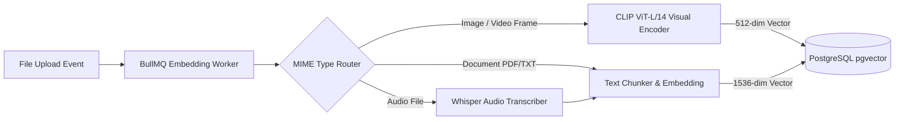

# Hybrid Full-Text & Vector Search Architecture (14_SEARCH_ARCHITECTURE.md)

## 1. Executive Summary & Design Goals
**BucketSpace** features a hybrid search engine combining instant full-text lexical search (Meilisearch) with multimodal AI semantic vector search (`pgvector`). Users can search across millions of objects by filename, metadata tags, visual appearance, or spoken audio content.

---

## 2. Hybrid Search System Architecture

```mermaid
graph TD
    UserQuery[User Search Query: 'blue 3d render'] --> Gateway[Search Service Gateway]
    
    par Dual Search Pipelines
        Gateway -->|1. Lexical Query| Meili[Meilisearch Engine]
        Gateway -->|2. Generate Text Embedding| ONNX[CLIP Text Encoder Inference]
    end

    ONNX -->|Vector Query| VectorDB[(PostgreSQL pgvector HNSW Index)]
    
    Meili -->|Top K Lexical Matches| RRF[Reciprocal Rank Fusion RRF Re-Ranker]
    VectorDB -->|Top K Vector Matches| RRF

    RRF -->|Ranked Merged Results| Output[Final Formatted Search Results]
```

---

## 3. Multimodal Vector Indexing Pipeline



---

## 4. Reciprocal Rank Fusion (RRF) Re-Ranking Algorithm

```typescript
export interface SearchResultItem {
  fileId: string;
  score: number;
}

export function reciprocalRankFusion(
  lexicalResults: string[],
  vectorResults: string[],
  k: number = 60
): Map<string, number> {
  const rrfScores = new Map<string, number>();

  // Accumulate Lexical RRF Scores
  lexicalResults.forEach((fileId, rank) => {
    const score = 1 / (k + (rank + 1));
    rrfScores.set(fileId, (rrfScores.get(fileId) || 0) + score);
  });

  // Accumulate Vector RRF Scores
  vectorResults.forEach((fileId, rank) => {
    const score = 1 / (k + (rank + 1));
    rrfScores.set(fileId, (rrfScores.get(fileId) || 0) + score);
  });

  return rrfScores;
}
```

---

## 5. Cross-References
- Database Vector Schema: [09_DATABASE.md](file:///c:/Users/Vanrajsinh/Desktop/DevVault/Building-Hub/BucketSpace/context/09_DATABASE.md)
- API Specs for Search: [10_API_SPECIFICATION.md](file:///c:/Users/Vanrajsinh/Desktop/DevVault/Building-Hub/BucketSpace/context/10_API_SPECIFICATION.md)
- Background Worker Processing: [07_BACKEND_ARCHITECTURE.md](file:///c:/Users/Vanrajsinh/Desktop/DevVault/Building-Hub/BucketSpace/context/07_BACKEND_ARCHITECTURE.md)
