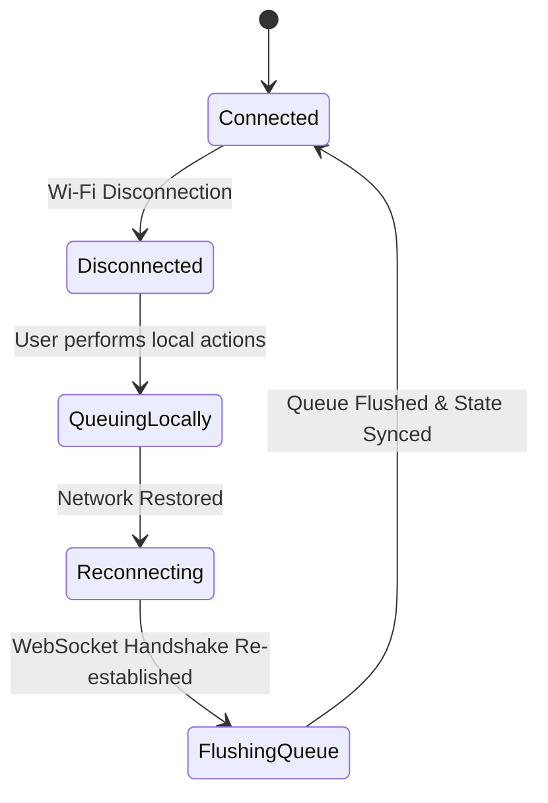

# Real-Time Sync & Collaboration Architecture (15_SYNC_ARCHITECTURE.md)

## 1. Executive Summary & Design Goals
**BucketSpace** provides a real-time collaborative workspace experience. When multiple users work in the same bucket, file updates, active cursors, selected object highlights, and upload progress are synchronized across all connected browser sessions with sub-100ms latency.

---

## 2. Event-Driven WebSocket Pub/Sub Topology

```mermaid
graph TD
    UserA[Client Browser A] -->|1. WSS State Mutation| WSServer[Fastify WebSocket Server]
    UserB[Client Browser B] <--|3. Broadcast WSS Event| WSServer
    
    WSServer -->|2. Publish Event| RedisPubSub[(Redis Pub/Sub Bus)]
    RedisPubSub -->|Cluster Sync| WSServerNode2[WebSocket Node 2]
    WSServerNode2 -->|Broadcast| UserC[Client Browser C]
```

---

## 3. Conflict Resolution Strategy & CRDT Mechanics

When concurrent file metadata operations occur (e.g. User A renames a file while User B updates its metadata tags), BucketSpace resolves conflicts using **Last-Write-Wins (LWW) Element-Set CRDT** timestamps paired with atomic PostgreSQL transactions.

```typescript
export interface MetadataMutationPayload {
  fileId: string;
  field: string;
  newValue: unknown;
  clientTimestamp: number; // Unix Epoch UTC ms
  vectorClock: number;
}

export function resolveLWWConflict(
  existingValue: { value: unknown; timestamp: number },
  incoming: MetadataMutationPayload
): boolean {
  // Accept mutation only if client timestamp is strictly greater
  return incoming.clientTimestamp > existingValue.timestamp;
}
```

---

## 4. Offline Mutation Queue & Reconnection Protocol

If a client loses network connectivity, UI mutations are queued locally in `indexedDB`. Upon network restoration, the queue flushes sequentially to the backend.



---

## 5. Cross-References
- WebSocket API Protocol Specs: [10_API_SPECIFICATION.md](file:///c:/Users/Vanrajsinh/Desktop/DevVault/Building-Hub/BucketSpace/context/10_API_SPECIFICATION.md)
- Client State Management: [16_STATE_MANAGEMENT.md](file:///c:/Users/Vanrajsinh/Desktop/DevVault/Building-Hub/BucketSpace/context/16_STATE_MANAGEMENT.md)
- Backend Gateway: [07_BACKEND_ARCHITECTURE.md](file:///c:/Users/Vanrajsinh/Desktop/DevVault/Building-Hub/BucketSpace/context/07_BACKEND_ARCHITECTURE.md)
