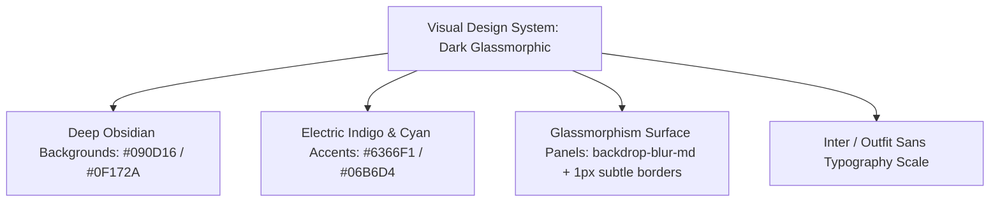
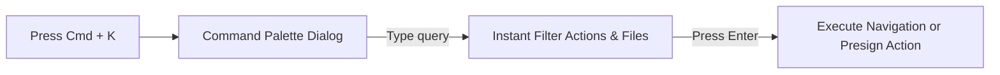

# UI/UX Principles & User Experience (17_UI_UX.md)

## 1. Executive Summary & Design Philosophy
**BucketSpace** delivers a **desktop-class, ultra-responsive visual workspace** inspired by modern high-productivity software (Linear, Vercel, Figma). It prioritizes speed, high-contrast dark aesthetics, keyboard-driven navigation, and drag-and-drop file operations.

---

## 2. Visual Aesthetic Standards

### Aesthetic Requirements
- **Dark Mode Default**: Pure dark/slate obsidian color palette to reduce eye fatigue during long engineering & creative sessions.
- **Glassmorphism Panels**: Floating sidebar panels and dialog modals use subtle translucent backgrounds (`rgba(15, 23, 42, 0.75)` with `backdrop-filter: blur(12px)`).
- **Micro-Animations**: All interactive buttons, hover states, and drag drop targets feature smooth 150ms cubic-bezier transition curves.

---

## 3. Keyboard-First Command Palette & Navigation

BucketSpace exposes a global Command Palette (`Cmd+K` / `Ctrl+K`) for lightning-fast workspace navigation without touching the mouse.

| Keyboard Shortcut | Action Executed |
|---|---|
| `Cmd + K` / `Ctrl + K` | Open Universal Command Palette |
| `Cmd + F` / `Ctrl + F` | Jump to Hybrid Semantic Search Bar |
| `Space` | Quick Preview File (Open Lightbox Viewer) |
| `Cmd + A` / `Ctrl + A` | Select All Objects in Current Folder |
| `Delete` / `Backspace` | Soft Delete Selected File Objects |
| `Escape` | Close Active Modal / Deselect Files |

---

## 4. Accessibility & WCAG 2.1 Level AA Compliance

- **Contrast Ratios**: All text elements maintain a minimum contrast ratio of `4.5:1` against dark backgrounds (`7:1` for body text).
- **Screen Reader ARIA Attributes**: File grids implement `role="grid"`, `aria-selected`, and `aria-rowindex`.
- **Keyboard Focus Rings**: Interactive elements feature a visible high-contrast `2px` focus ring ring in electric indigo (`#6366F1`).

---

## 5. Cross-References
- Design System Tokens: [18_DESIGN_SYSTEM.md](file:///c:/Users/Vanrajsinh/Desktop/DevVault/Building-Hub/BucketSpace/context/18_DESIGN_SYSTEM.md)
- Component Library Implementation: [19_COMPONENT_LIBRARY.md](file:///c:/Users/Vanrajsinh/Desktop/DevVault/Building-Hub/BucketSpace/context/19_COMPONENT_LIBRARY.md)
- Frontend Architecture: [08_FRONTEND_ARCHITECTURE.md](file:///c:/Users/Vanrajsinh/Desktop/DevVault/Building-Hub/BucketSpace/context/08_FRONTEND_ARCHITECTURE.md)
