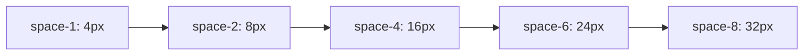

# Design System & Token Specification (18_DESIGN_SYSTEM.md)

## 1. Executive Summary & Design System Token Structure
The **BucketSpace Design System** standardizes design tokens across all React components using Tailwind CSS variables. Ad-hoc colors, arbitrary pixel paddings, or inline styles are strictly prohibited.

---

## 2. Color Palette Tokens

```css
/* Design System CSS Variable Baseline */
:root {
  /* Brand Backgrounds */
  --bg-primary: #07090e;
  --bg-secondary: #0f172a;
  --bg-tertiary: #1e293b;
  --bg-glass: rgba(15, 23, 42, 0.75);

  /* Borders & Dividers */
  --border-subtle: rgba(255, 255, 255, 0.08);
  --border-strong: rgba(255, 255, 255, 0.18);
  --border-focus: #6366f1;

  /* Brand Accents */
  --accent-primary: #6366f1;      /* Electric Indigo */
  --accent-primary-hover: #4f46e5;
  --accent-secondary: #06b6d4;    /* Cyan Glow */
  --accent-success: #10b981;      /* Emerald Green */
  --accent-warning: #f59e0b;      /* Amber */
  --accent-danger: #ef4444;       /* Rose Red */

  /* Text & Foreground */
  --text-primary: #f8fafc;
  --text-secondary: #94a3b8;
  --text-muted: #64748b;
}
```

---

## 3. Typography Scale & Fonts

Primary Font: `Inter`, system-ui, sans-serif  
Code / Monospace Font: `JetBrains Mono`, monospace  

| Token | Font Size | Line Height | Weight | Usage |
|---|---|---|---|---|
| `text-xs` | `0.75rem` (12px) | `1.0rem` | 400 | Micro labels, badge counts, file extensions. |
| `text-sm` | `0.875rem` (14px) | `1.25rem` | 400 / 500 | Body text, grid item names, table cells. |
| `text-base` | `1.0rem` (16px) | `1.5rem` | 500 | Input text, button labels, navigation links. |
| `text-lg` | `1.125rem` (18px) | `1.75rem` | 600 | Modal titles, sub-headers, card titles. |
| `text-2xl` | `1.5rem` (24px) | `2.0rem` | 700 | Page titles, primary dashboard headings. |

---

## 4. Spacing & Elevation Grid



### Elevation & Glassmorphic Shadows
- **Card Glass Surface**: `box-shadow: 0 4px 20px -2px rgba(0, 0, 0, 0.5), inset 0 1px 0 0 rgba(255, 255, 255, 0.1)`
- **Modal Elevation**: `box-shadow: 0 20px 50px -10px rgba(0, 0, 0, 0.8), inset 0 1px 0 0 rgba(255, 255, 255, 0.15)`

---

## 5. Cross-References
- UI/UX Guidelines: [17_UI_UX.md](file:///c:/Users/Vanrajsinh/Desktop/DevVault/Building-Hub/BucketSpace/context/17_UI_UX.md)
- Component Library Specs: [19_COMPONENT_LIBRARY.md](file:///c:/Users/Vanrajsinh/Desktop/DevVault/Building-Hub/BucketSpace/context/19_COMPONENT_LIBRARY.md)
- Coding Standards: [20_CODING_STANDARDS.md](file:///c:/Users/Vanrajsinh/Desktop/DevVault/Building-Hub/BucketSpace/context/20_CODING_STANDARDS.md)
