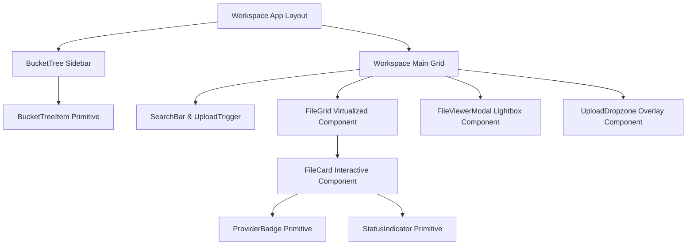

# Component Library Specifications (19_COMPONENT_LIBRARY.md)

## 1. Executive Summary & Component Architecture
The **BucketSpace Component Library** (`apps/web/src/components`) consists of atomic UI primitives and domain-specific workspace modules.

---

## 2. Component Hierarchy Map



---

## 3. Core Component Specifications

### 3.1 `FileCard.tsx`

```typescript
import React from 'react';
import { LucideIcon, Image, FileText, Video, Music } from 'lucide-react';

export interface FileCardProps {
  fileId: string;
  filename: string;
  s3Key: string;
  sizeBytes: number;
  mimeType: string;
  thumbnailUrl?: string;
  isSelected: boolean;
  onSelect: (fileId: string, event: React.MouseEvent) => void;
  onDoubleClick: (fileId: string) => void;
}

export const FileCard: React.FC<FileCardProps> = ({
  fileId,
  filename,
  sizeBytes,
  mimeType,
  thumbnailUrl,
  isSelected,
  onSelect,
  onDoubleClick,
}) => {
  const formatSize = (bytes: number) => {
    if (bytes < 1024 * 1024) return `${(bytes / 1024).toFixed(1)} KB`;
    return `${(bytes / (1024 * 1024)).toFixed(1)} MB`;
  };

  return (
    <div
      onClick={(e) => onSelect(fileId, e)}
      onDoubleClick={() => onDoubleClick(fileId)}
      className={`group relative flex flex-col rounded-xl border p-3 transition-all duration-150 cursor-pointer ${
        isSelected
          ? 'border-indigo-500 bg-indigo-500/10 ring-2 ring-indigo-500/50'
          : 'border-slate-800 bg-slate-900/60 hover:border-slate-700 hover:bg-slate-800/80'
      }`}
    >
      <div className="flex h-32 w-full items-center justify-center overflow-hidden rounded-lg bg-slate-950/80">
        {thumbnailUrl ? (
          
        ) : (
          <FileText className="h-10 w-10 text-slate-500 group-hover:text-slate-300" />
        )}
      </div>
      <div className="mt-2.5 flex flex-col">
        <span className="truncate text-sm font-medium text-slate-200" title={filename}>
          {filename}
        </span>
        <span className="text-xs text-slate-500">{formatSize(sizeBytes)}</span>
      </div>
    </div>
  );
};
```

---

## 4. Cross-References
- Design Tokens: [18_DESIGN_SYSTEM.md](file:///c:/Users/Vanrajsinh/Desktop/DevVault/Building-Hub/BucketSpace/context/18_DESIGN_SYSTEM.md)
- Frontend Architecture: [08_FRONTEND_ARCHITECTURE.md](file:///c:/Users/Vanrajsinh/Desktop/DevVault/Building-Hub/BucketSpace/context/08_FRONTEND_ARCHITECTURE.md)
- Testing Strategy for UI: [24_TESTING_STRATEGY.md](file:///c:/Users/Vanrajsinh/Desktop/DevVault/Building-Hub/BucketSpace/context/24_TESTING_STRATEGY.md)
