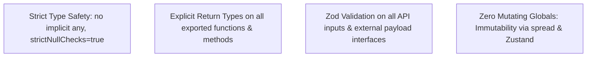

# Coding Standards & AI Agent Operating Rules (20_CODING_STANDARDS.md)

## 1. Executive Summary & Code Quality Directives
All code in **BucketSpace** MUST adhere to strict type-safety, functional immutability, zero `any` explicit casting, and standardized error propagation. These rules bind both human engineers and AI coding assistants.

---

## 2. TypeScript & Code Style Rules



### Core Code Guidelines
1. **Explicit Types**: Never rely on implicit `any`. All function parameters and public class methods MUST state explicit return types.
2. **Async Safety**: Always `await` Promises. Floating un-handled promises (`void asyncFunc()`) are prohibited unless explicitly wrapped in a try/catch error logger.
3. **No Magic Strings**: All status strings, event names, or provider types MUST be declared as TypeScript string enums or const objects in `@bucketspace/shared`.

```typescript
// BAD (Prohibited Magic String)
if (bucket.provider === 's3') { ... }

// GOOD (Type-safe Enum)
import { ProviderType } from '@bucketspace/shared';
if (bucket.provider === ProviderType.AWS_S3) { ... }
```

---

## 3. Strict Rules for AI Coding Assistants

> [!CAUTION]
> **AI AGENT MANDATORY OPERATING RULES**
> 1. **Never Infer Schemas or Paths**: Before writing or modifying any code consuming database tables or API contracts, you MUST view the exact schema definitions in [09_DATABASE.md](file:///c:/Users/Vanrajsinh/Desktop/DevVault/Building-Hub/BucketSpace/context/09_DATABASE.md) and [10_API_SPECIFICATION.md](file:///c:/Users/Vanrajsinh/Desktop/DevVault/Building-Hub/BucketSpace/context/10_API_SPECIFICATION.md).
> 2. **Never Create Dummy Fallbacks or Swallow Errors**: Do NOT hide runtime errors using empty `try/catch {}` blocks or returning empty arrays/null objects without logging.
> 3. **Run Verification Commands**: Always execute type checks (`pnpm type-check`) and linting (`pnpm lint`) before declaring a task complete.
> 4. **Human-Centric Clean Code & Feature Structure**: Write clean, readable, self-documenting code structured intuitively by domain functionality. Avoid "AI-generated code bloat", opaque wrappers, or convoluted abstractions that human developers find difficult to understand.

---

## 4. Linting & Formatting Configuration

```json
{
  "extends": [
    "eslint:recommended",
    "plugin:@typescript-eslint/strict-type-checked",
    "plugin:react-hooks/recommended",
    "prettier"
  ],
  "rules": {
    "@typescript-eslint/no-explicit-any": "error",
    "@typescript-eslint/explicit-function-return-type": "warn",
    "no-console": ["error", { "allow": ["warn", "error"] }]
  }
}
```

---

## 5. Cross-References
- Repository Structure: [06_REPOSITORY_STRUCTURE.md](file:///c:/Users/Vanrajsinh/Desktop/DevVault/Building-Hub/BucketSpace/context/06_REPOSITORY_STRUCTURE.md)
- Error Handling Standard: [21_ERROR_HANDLING.md](file:///c:/Users/Vanrajsinh/Desktop/DevVault/Building-Hub/BucketSpace/context/21_ERROR_HANDLING.md)
- Testing Requirements: [24_TESTING_STRATEGY.md](file:///c:/Users/Vanrajsinh/Desktop/DevVault/Building-Hub/BucketSpace/context/24_TESTING_STRATEGY.md)
