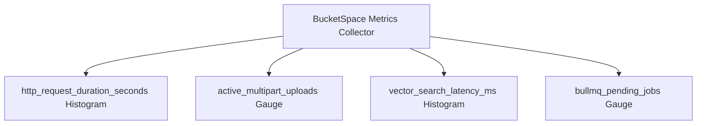

# Observability, Metrics & Telemetry (23_OBSERVABILITY.md)

## 1. Executive Summary & Telemetry Strategy
**BucketSpace** uses **OpenTelemetry (OTel)** for vendor-neutral metrics, distributed tracing, and APM. Prometheus scrapes key operational metrics, while trace contexts propagate across HTTP, WebSockets, and BullMQ worker queues.

---

## 2. Key Prometheus Performance Metrics



### Core Metric Specifications

| Metric Name | Type | Labels | Description & SLO Target |
|---|---|---|---|
| `bucketspace_http_request_duration_seconds` | Histogram | `method`, `route`, `status` | API response latency budget (p95 `< 150ms`). |
| `bucketspace_vector_search_latency_ms` | Histogram | `workspace_id`, `index_type` | Vector search latency budget (p95 `< 50ms`). |
| `bucketspace_presigned_urls_issued_total` | Counter | `provider`, `operation` | Total presigned upload/download URLs issued. |
| `bucketspace_bullmq_queue_depth` | Gauge | `queue_name` | Number of unhandled background jobs (Alert if `> 500`). |

---

## 3. Health & Readiness Probes

All API instances expose standardized Kubernetes probes:

```typescript
// Fastify Health Check Handler
fastify.get('/healthz', async (_req, reply) => {
  return reply.status(200).send({ status: 'OK', timestamp: new Date().toISOString() });
});

fastify.get('/readyz', async (_req, reply) => {
  try {
    // Verify Postgres DB connection
    await prisma.$queryRaw`SELECT 1`;
    // Verify Redis ping
    await redis.ping();
    return reply.status(200).send({ status: 'READY' });
  } catch (err) {
    return reply.status(503).send({ status: 'NOT_READY', error: (err as Error).message });
  }
});
```

---

## 4. Alerting Threshold Matrix

```yaml
groups:
  - name: bucketspace_alerts
    rules:
      - alert: HighSearchLatency
        expr: histogram_quantile(0.95, sum(rate(bucketspace_vector_search_latency_ms_bucket[5m])) by (le)) > 200
        for: 2m
        labels:
          severity: critical
        annotations:
          summary: "Vector search 95th percentile latency exceeded 200ms budget."

      - alert: HighQueueBacklog
        expr: bucketspace_bullmq_queue_depth{queue_name="embedding"} > 500
        for: 5m
        labels:
          severity: warning
        annotations:
          summary: "AI Embedding queue backlog exceeded 500 pending jobs."
```

---

## 5. Cross-References
- Structured Logging Standard: [22_LOGGING.md](file:///c:/Users/Vanrajsinh/Desktop/DevVault/Building-Hub/BucketSpace/context/22_LOGGING.md)
- Backend Architecture: [07_BACKEND_ARCHITECTURE.md](file:///c:/Users/Vanrajsinh/Desktop/DevVault/Building-Hub/BucketSpace/context/07_BACKEND_ARCHITECTURE.md)
- Performance Budgets: [27_PERFORMANCE.md](file:///c:/Users/Vanrajsinh/Desktop/DevVault/Building-Hub/BucketSpace/context/27_PERFORMANCE.md)
