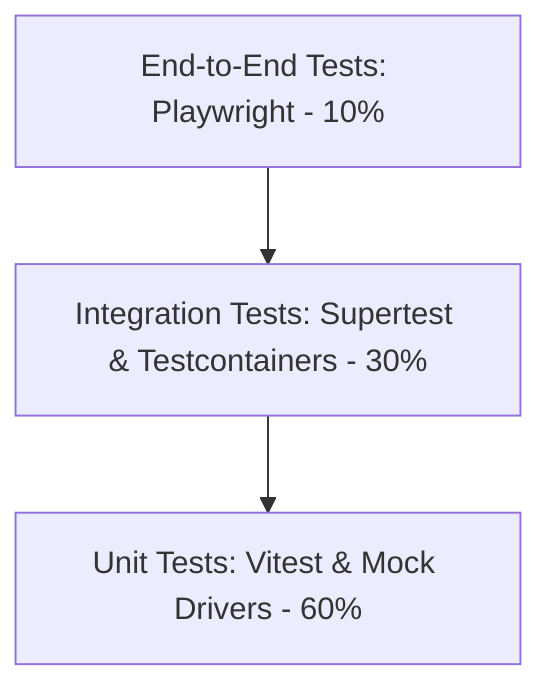

# Testing Strategy & Quality Assurance (24_TESTING_STRATEGY.md)

## 1. Executive Summary & Testing Pyramid
**BucketSpace** enforces automated test validation across all layers of the monorepo prior to merging code into the `main` branch.



---

## 2. Test Layer Specifications

### 2.1 Unit Tests (Vitest)
- **Scope**: Pure domain logic, Zod validation schemas, S3 key parsing, RRF algorithm, Zustand store reducers.
- **Location**: Co-located adjacent to source files (`*.test.ts`).
- **Execution Target**: `< 10 seconds` total suite execution time.

```typescript
// Example Unit Test (src/modules/storage/s3key.test.ts)
import { describe, it, expect } from 'vitest';
import { S3Key } from './s3key';

describe('S3Key Value Object', () => {
  it('should sanitize leading slashes and extract valid file extensions', () => {
    const key = S3Key.create('///workspace/renders/banner.PNG');
    expect(key.value).toBe('workspace/renders/banner.PNG');
    expect(key.extension).toBe('png');
  });

  it('should throw DomainError for keys exceeding 1024 characters', () => {
    const invalidKey = 'a'.repeat(1025);
    expect(() => S3Key.create(invalidKey)).toThrow();
  });
});
```

---

### 2.2 Integration Tests (Supertest & Testcontainers)
- **Scope**: Fastify API Gateway endpoints, PostgreSQL `pgvector` HNSW queries, Redis queue job handlers.
- **Infrastructure**: Uses Testcontainers to launch ephemeral PostgreSQL 16 and Redis docker instances.

---

### 2.3 E2E UI Tests (Playwright)
- **Scope**: Full user upload flows, drag and drop, hybrid semantic search, and sharing link generation.
- **Target Browsers**: Chromium, Firefox, WebKit.

---

## 3. Mandatory CI Commands & Coverage Target

```bash
# Executed automatically in GitHub Actions CI
pnpm test:unit       # Runs all Vitest unit tests
pnpm test:integration# Runs integration tests against Postgres Testcontainer
pnpm test:e2e        # Executes Playwright browser automation
pnpm test:coverage   # Asserts > 85% line and branch code coverage
```

---

## 4. Cross-References
- Repository Structure: [06_REPOSITORY_STRUCTURE.md](file:///c:/Users/Vanrajsinh/Desktop/DevVault/Building-Hub/BucketSpace/context/06_REPOSITORY_STRUCTURE.md)
- DevOps CI Pipelines: [26_DEVOPS.md](file:///c:/Users/Vanrajsinh/Desktop/DevVault/Building-Hub/BucketSpace/context/26_DEVOPS.md)
- Coding Standards: [20_CODING_STANDARDS.md](file:///c:/Users/Vanrajsinh/Desktop/DevVault/Building-Hub/BucketSpace/context/20_CODING_STANDARDS.md)
