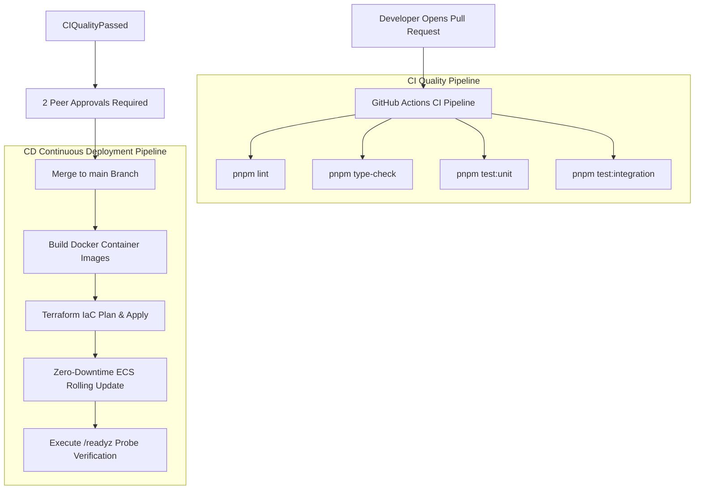

# DevOps & CI/CD Pipelines (26_DEVOPS.md)

## 1. Executive Summary & CI/CD Philosophy
**BucketSpace** enforces fully automated CI/CD pipelines via **GitHub Actions**. No code is deployed to production manually from developer workstations.

---

## 2. CI/CD Pipeline Workflow



---

## 3. GitHub Actions CI Blueprint (`.github/workflows/ci.yml`)

```yaml
name: BucketSpace CI Quality Gate

on:
  push:
    branches: [main, staging]
  pull_request:
    branches: [main, staging]

jobs:
  quality-gate:
    runs-on: ubuntu-latest
    steps:
      - uses: actions/checkout@v4
      - uses: pnpm/action-setup@v3
        with:
          version: 9
      - uses: actions/setup-node@v4
        with:
          node-version: 22
          cache: 'pnpm'

      - name: Install Dependencies
        run: pnpm install --frozen-lockfile

      - name: Type Check Monorepo
        run: pnpm type-check

      - name: Execute Linter Rules
        run: pnpm lint

      - name: Run Vitest Unit Tests
        run: pnpm test:unit

      - name: Build Monorepo Packages & Apps
        run: pnpm build
```

---

## 4. Branching Model & Release Tags

- **`main`**: Production branch. Every merge triggers automated deployment to production after passing CI/CD probes.
- **`staging`**: Pre-production integration branch. Deploys to staging environment for automated Playwright E2E suites.
- **`feature/*`**: Short-lived feature branches created off `main`. Requires PR review and CI green checks before merging.
- **Semantic Versioning**: Releases tagged automatically using `vX.Y.Z` semantics (e.g. `v1.2.0`).

---

## 5. Cross-References
- Infrastructure & Docker Blueprints: [25_DEPLOYMENT.md](file:///c:/Users/Vanrajsinh/Desktop/DevVault/Building-Hub/BucketSpace/context/25_DEPLOYMENT.md)
- Testing Strategy: [24_TESTING_STRATEGY.md](file:///c:/Users/Vanrajsinh/Desktop/DevVault/Building-Hub/BucketSpace/context/24_TESTING_STRATEGY.md)
- Observability Probes: [23_OBSERVABILITY.md](file:///c:/Users/Vanrajsinh/Desktop/DevVault/Building-Hub/BucketSpace/context/23_OBSERVABILITY.md)
