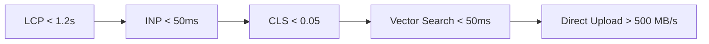

# Performance Architecture & Benchmarks (27_PERFORMANCE.md)

## 1. Executive Summary & Latency Budgets
**BucketSpace** is engineered for high-performance file workflows. Page loads, vector similarity queries, and upload initiation maintain strict quantitative latency budgets.

---

## 2. Quantitative Performance Budgets



| Subsystem / Metric | Target Latency Budget (p95) | Critical Alert Threshold |
|---|---|---|
| **Largest Contentful Paint (LCP)** | `< 1.2 seconds` | `> 2.5 seconds` |
| **Interaction to Next Paint (INP)** | `< 50 milliseconds` | `> 200 milliseconds` |
| **Cumulative Layout Shift (CLS)** | `< 0.05` | `> 0.1` |
| **API Presigned URL Generation** | `< 45 milliseconds` | `> 150 milliseconds` |
| **pgvector HNSW Semantic Query** | `< 35 milliseconds` | `> 100 milliseconds` |
| **Direct S3 Upload Throughput** | `Line Speed (Browser Max)` | `< 50 MB/s` |

---

## 3. Zero-Copy Streaming Optimization Rules

1. **Payload Bypass Protocol**: Never buffer file bytes inside Node.js memory. All file payload traffic streams directly from client Web Workers to S3/R2 endpoints.
2. **Database Query Select Scoping**: Never execute `SELECT *` queries on `file_objects` or `object_embeddings`. Always explicitly select fields required for the UI view to minimize database memory footprint.

```typescript
// BAD (Saturates DB bandwidth & RAM with vector blobs)
const file = await prisma.fileObject.findUnique({ where: { id } });

// GOOD (Selects metadata fields only; excludes 1536-dim vectors)
const file = await prisma.fileObject.findUnique({
  where: { id },
  select: {
    id: true,
    filename: true,
    s3Key: true,
    sizeBytes: true,
    mimeType: true,
  },
});
```

---

## 4. Cross-References
- Frontend Architecture & Workers: [08_FRONTEND_ARCHITECTURE.md](file:///c:/Users/Vanrajsinh/Desktop/DevVault/Building-Hub/BucketSpace/context/08_FRONTEND_ARCHITECTURE.md)
- Storage Layer Details: [13_STORAGE_ARCHITECTURE.md](file:///c:/Users/Vanrajsinh/Desktop/DevVault/Building-Hub/BucketSpace/context/13_STORAGE_ARCHITECTURE.md)
- Observability Metrics: [23_OBSERVABILITY.md](file:///c:/Users/Vanrajsinh/Desktop/DevVault/Building-Hub/BucketSpace/context/23_OBSERVABILITY.md)
