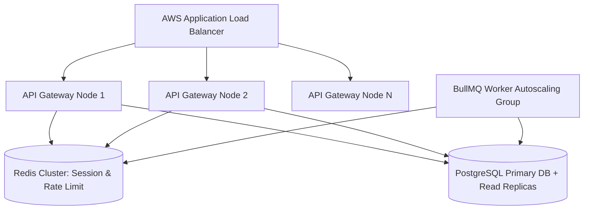

# Scalability, Sharding & High Availability (28_SCALABILITY.md)

## 1. Executive Summary & Scaling Architecture
**BucketSpace** is designed to scale horizontally to support 100,000+ active workspaces, billions of file metadata objects, and petabytes of multi-cloud storage traffic.

---

## 2. Horizontal Scaling Topology



---

## 3. Database Sharding & Partitioning Strategy

As the `file_objects` and `object_embeddings` tables grow beyond 50,000,000 rows, PostgreSQL Declarative Table Partitioning partitions data by `workspace_id`:

```sql
-- PostgreSQL Workspace Hash Partitioning DDL
CREATE TABLE file_objects (
    id UUID NOT NULL,
    workspace_id UUID NOT NULL,
    bucket_id UUID NOT NULL,
    s3_key VARCHAR(1024) NOT NULL,
    filename VARCHAR(512) NOT NULL,
    size_bytes BIGINT NOT NULL,
    status VARCHAR(50) NOT NULL,
    created_at TIMESTAMPTZ DEFAULT CURRENT_TIMESTAMP,
    PRIMARY KEY (id, workspace_id)
) PARTITION BY HASH (workspace_id);

-- Create 16 Initial Hash Partitions
CREATE TABLE file_objects_p0 PARTITION OF file_objects FOR VALUES WITH (MODULUS 16, REMAINDER 0);
CREATE TABLE file_objects_p1 PARTITION OF file_objects FOR VALUES WITH (MODULUS 16, REMAINDER 1);
-- ... P2 through P15
```

---

## 4. Rate-Limiting & Quota Engine (Token Bucket)

To prevent API abuse and denial-of-service, API endpoints enforce rate-limiting via Redis token bucket counters:

```typescript
export interface RateLimitConfig {
  points: number; // Max requests
  durationSeconds: number; // Window size
}

export const RATE_LIMIT_RULES: Record<string, RateLimitConfig> = {
  PRESIGN_UPLOAD: { points: 100, durationSeconds: 60 }, // 100 uploads / min
  VECTOR_SEARCH: { points: 60, durationSeconds: 60 },   // 60 searches / min
  AUTHENTICATION: { points: 10, durationSeconds: 60 },  // 10 auth attempts / min
};
```

---

## 5. Cross-References
- Database Schema: [09_DATABASE.md](file:///c:/Users/Vanrajsinh/Desktop/DevVault/Building-Hub/BucketSpace/context/09_DATABASE.md)
- Performance Architecture: [27_PERFORMANCE.md](file:///c:/Users/Vanrajsinh/Desktop/DevVault/Building-Hub/BucketSpace/context/27_PERFORMANCE.md)
- System Architecture Topology: [04_SYSTEM_ARCHITECTURE.md](file:///c:/Users/Vanrajsinh/Desktop/DevVault/Building-Hub/BucketSpace/context/04_SYSTEM_ARCHITECTURE.md)
