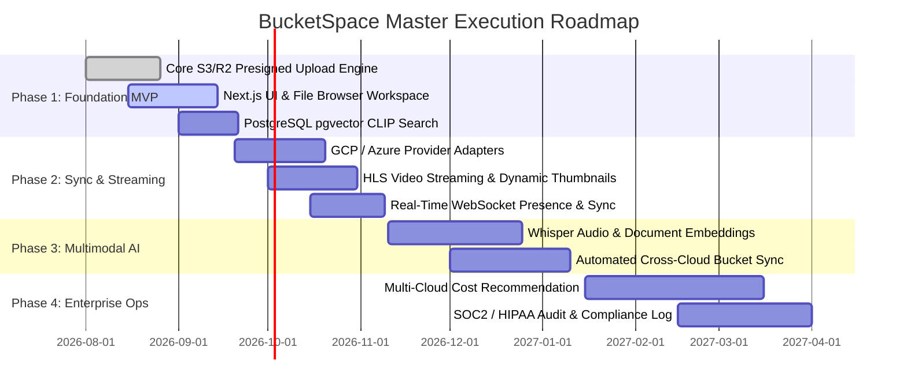

# Project Execution Roadmap & Phasing (29_PROJECT_ROADMAP.md)

## 1. Executive Summary & Phasing Strategy
**BucketSpace** development is divided into four distinct execution phases. Each phase establishes clear architectural boundaries, testing criteria, and Definition of Done gates.

---

## 2. Master Phase Timeline & Overview

---

## 3. Detailed Phase Breakdown

### Phase 1: Foundation MVP (Weeks 1 - 8)
- **Primary Objectives**: Deliver unified AWS S3 & Cloudflare R2 file browsing, direct Web Worker chunked presigned uploads, and basic visual CLIP vector search.
- **Key Deliverables**:
  - `packages/storage-adapters` (S3 & R2 drivers).
  - Fastify presign API endpoints (`POST /api/v1/files/upload/presign`).
  - Next.js 15 App Router file workspace (`FileGrid`, `BucketTree`).
  - `pgvector` database schema & HNSW vector indexes.
- **Estimated Complexity**: High (Core Infrastructure).
- **Definition of Done**: Successfully upload a 5GB file via presigned URLs and perform sub-100ms CLIP semantic search across 10,000 image assets.

---

### Phase 2: Advanced Sync & Media Streaming (Weeks 9 - 16)
- **Primary Objectives**: Expand provider coverage to GCP & Azure, implement HLS video preview streaming, and enable WebSocket presence.
- **Key Deliverables**:
  - GCP Storage & Azure Blob Storage drivers.
  - Media worker HLS video transcoding pipeline.
  - WebSocket pub/sub presence server.
- **Estimated Complexity**: Medium-High.

---

### Phase 3: Multimodal AI Intelligence (Weeks 17 - 24)
- **Primary Objectives**: Integrate Whisper audio speech-to-text vectorization, document OCR chunking, and declarative cross-cloud bucket sync.

---

### Phase 4: Enterprise Automation & Governance (Weeks 25 - 36)
- **Primary Objectives**: Deliver multi-cloud cost optimization analysis, automated lifecycle migration rules, and compliance audit exports.

---

## 4. Cross-References
- Product Vision: [01_PRODUCT_VISION.md](file:///c:/Users/Vanrajsinh/Desktop/DevVault/Building-Hub/BucketSpace/context/01_PRODUCT_VISION.md)
- Scope Boundaries: [03_PROJECT_SCOPE.md](file:///c:/Users/Vanrajsinh/Desktop/DevVault/Building-Hub/BucketSpace/context/03_PROJECT_SCOPE.md)
- Decision History Log: [30_DECISION_LOG.md](file:///c:/Users/Vanrajsinh/Desktop/DevVault/Building-Hub/BucketSpace/context/30_DECISION_LOG.md)
