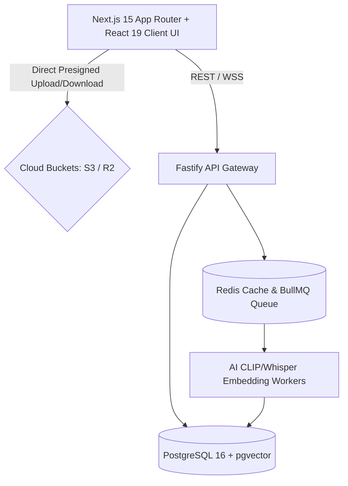

# BucketSpace Project State & Active Memory (PROJECT_STATE.md)

This document is the **Active Project Memory** for **BucketSpace**. It tracks high-level project goals, active architectural rules, roadmap state, and production-readiness requirements.

When architecture, goals, or rules change, this document MUST be updated, removing deprecated architectural patterns and establishing new baseline decisions.

---

## 1. Core Project Goal & Vision
Build a production-grade, ultra-secure, reliable, and high-performance **AI-First Multi-Cloud Object Storage Workspace** that unifies AWS S3, Cloudflare R2, GCP Storage, Azure Blobs, and MinIO into a visual workspace featuring sub-50ms vector search, direct-to-cloud presigned transfers, zero-trust security, and real-time collaboration.

---

## 2. Active Engineering Behavioral Rules

1. **Automated Git Commit and Push Protocol**:
   - Whenever any task or coding request is completed, automatically stage all changes (`git add .`), commit with a descriptive message, and push to the remote repository (`git push origin <branch>`).
2. **Active Architectural State Maintenance**:
   - Keep `context/PROJECT_STATE.md` and the `/context` documentation hub in sync with all architectural decisions, goal changes, and system rules.
   - Instantly remove deprecated architecture sections when replacement patterns are adopted.
   - Omit casual conversation; retain only technical goals, rules, and architecture specs.
3. **Human-Centric Clean Code & Modular Feature Structure**:
   - Every module must be intuitively grouped by feature functionality so any developer can easily understand the codebase.
   - Code must be clean, readable, self-documenting, and free from AI-style boilerplate bloat or unnecessarily complex abstractions.

---

## 3. Active System Architecture Baseline

- **Frontend**: Next.js 15 App Router, Tailwind CSS dark glassmorphic design system, Web Workers for chunked upload threads.
- **Backend**: Fastify API Gateway with TypeScript, Zod schema validation, W3C trace propagation.
- **Database**: PostgreSQL 16 + `pgvector` extension with HNSW indexes for metadata and vector search.
- **Storage**: Presigned S3/R2 direct-to-cloud multipart upload engine.
- **Queues**: Redis + BullMQ for asynchronous AI vector embedding and media processing.

---

## 4. Current Milestone & Focus
- **Active Phase**: Phase 1 MVP Foundation.
- **Current Objectives**: Monorepo codebase setup, core S3/R2 storage driver implementation, presigned URL issuance, and visual workspace file tree UI.

---

## 5. Security & Reliability Directives
- **Zero-Trust Client Access**: Presigned cryptographic temporary URLs for all file read/write operations.
- **Credentials Protection**: AES-256-GCM envelope encryption for cloud bucket keys using HashiCorp Vault / AWS KMS.
- **Immutable Audit Logging**: Every administrative action, credential update, and file mutation logged to `audit_logs`.
