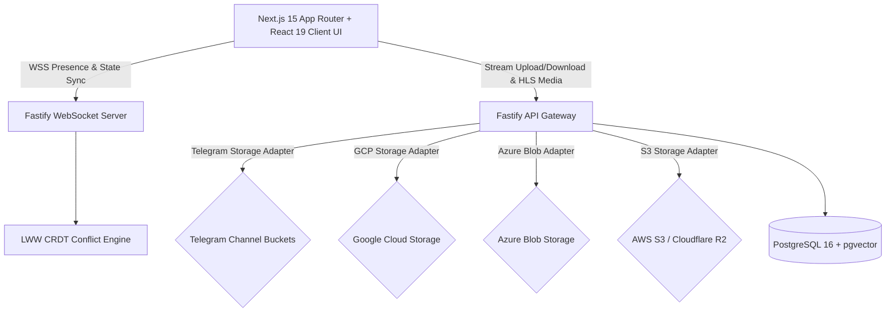

# BucketSpace Project State & Active Memory (PROJECT_STATE.md)

This document is the **Active Project Memory** for **BucketSpace**. It tracks high-level project goals, active architectural rules, roadmap state, and production-readiness requirements.

When architecture, goals, or rules change, this document MUST be updated, removing deprecated architectural patterns and establishing new baseline decisions.

---

## 1. Core Project Goal & Vision
Build a production-grade, ultra-secure, reliable, and high-performance **AI-First Telegram Cloud Drive & Multi-Cloud Storage Workspace**. Phase 1 established the **Telegram Private Channel Storage** engine. Phase 2 extends coverage to **GCP Cloud Storage**, **Azure Blob Storage**, **AWS S3 / Cloudflare R2**, **HLS Video Streaming & Dynamic Thumbnails**, and **Real-Time WebSocket Presence with LWW CRDT Conflict Resolution**.

---

## 2. Active Engineering Behavioral Rules

1. **Automated Git Commit and Push Protocol**:
   - Whenever any task or coding request is completed, automatically stage all changes (`git add .`), commit with a descriptive message, and push to the remote repository (`git push origin <branch>`).
2. **Active Architectural State Maintenance**:
   - Keep `context/PROJECT_STATE.md` and the `/context` documentation hub in sync with all architectural decisions, goal changes, and system rules.
   - Instantly remove deprecated architecture sections when replacement patterns are adopted.
   - Omit casual conversation; retain only technical goals, rules, and architecture specs.
3. **Human-Centric Clean Code & Modular Feature Structure**:
   - Every module must be intuitively grouped by feature functionality (`modules/telegram`, `modules/media`, `modules/websocket`, `components/file`, `components/media`) so any developer can easily understand the codebase.
   - Code must be clean, readable, self-documenting, and free from AI-style boilerplate bloat or unnecessarily complex abstractions.

---

## 3. Active System Architecture Baseline

- **Universal Storage Provider Engine**: `IStorageProvider` contract implemented by `TelegramStorageAdapter`, `GCPStorageAdapter`, `AzureBlobStorageAdapter`, and `S3StorageAdapter`.
- **HLS Video Preview Engine**: Fastify `MediaController` generating dynamic `.m3u8` playlists and TS video segment streaming.
- **WebSocket Presence & Sync**: Fastify WebSocket server (`WebSocketController`) handling workspace presence badges, dynamic cursors, and Last-Write-Wins (LWW) CRDT metadata conflict resolution.
- **Frontend**: Next.js 15 App Router with Tailwind CSS dark glassmorphic design, `HLSVideoPlayer`, `useWebSocketSync`, and multi-cloud file management.
- **Database**: PostgreSQL 16 + `pgvector` for file metadata, chunk maps, embeddings, and audit logs.

---

## 4. Current Milestone & Focus
- **Active Phase**: Phase 3 — **Multimodal AI Intelligence & Automated Cross-Cloud Sync** ✅ COMPLETED.
- **Key Phase 3 Deliverables**:
  - **Whisper Speech-to-Text & Document OCR Engine**: Processing pipeline in `apps/api/src/modules/ai/ai.service.ts` generating speech transcripts & extracted document text into vector embeddings.
  - **pgvector Multimodal Semantic Search**: Hybrid Cosine similarity vector search endpoint `/api/v1/ai/search` supporting `HYBRID`, `TRANSCRIPT`, `DOCUMENT`, and `VISUAL` query modes.
  - **Cross-Cloud Automated Bucket Sync Engine**: `SyncEngineService` in `apps/api/src/modules/sync/sync.engine.ts` executing background chunk streaming replication between Telegram, GCP, Azure, and S3/R2 with transactional database updates & audit logging.
  - **Sync Policy & History Controller**: API endpoints (`POST /api/v1/sync/policies`, `POST /api/v1/sync/policies/:policyId/trigger`, `GET /api/v1/sync/jobs/:workspaceId`).
  - **Frontend UI Components**: Next.js 15 `AISearchModal` (full-screen glassmorphic semantic vector search modal) & `SyncPolicyPanel` (cross-cloud policy management & progress visualization).

---

## 5. Security & Reliability Directives
- **Multi-Cloud Isolation**: Dedicated bucket isolation for Telegram Channels, GCP Buckets, Azure Containers, and S3 Buckets.
- **Credentials Protection**: Envelope encryption for cloud tokens and access keys.
- **Conflict Resolution**: LWW CRDT with deterministic 3-tier tie-breaking (timestamp → vectorClock → userId).
- **Rate Limit Resilience**: Provider-specific backoff retry mechanisms for 429 rate limit responses.
- **Memory Safety**: Stream buffering capped at safety limits (52MB–100MB) via shared `streamToBuffer` utility.
- **XSS Prevention**: All user-provided content (filenames) XML-escaped before SVG rendering.
- **Connection Health**: Server-side WebSocket ping/pong heartbeat (30s) with dead connection cleanup.
- **Transactional Sync Safety**: Cross-cloud sync reads source chunks stream-by-stream and commits destination records transactionally with full audit logging.
