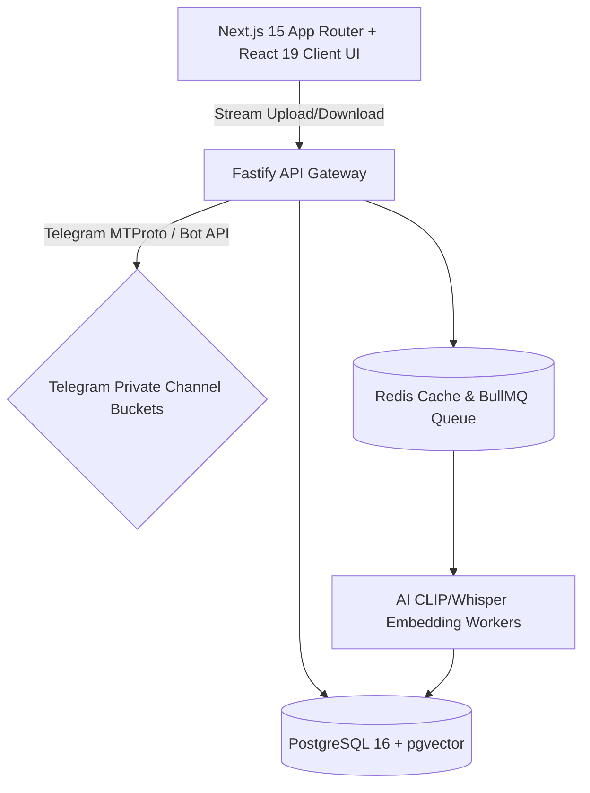

# BucketSpace Project State & Active Memory (PROJECT_STATE.md)

This document is the **Active Project Memory** for **BucketSpace**. It tracks high-level project goals, active architectural rules, roadmap state, and production-readiness requirements.

When architecture, goals, or rules change, this document MUST be updated, removing deprecated architectural patterns and establishing new baseline decisions.

---

## 1. Core Project Goal & Vision
Build a production-grade, ultra-secure, reliable, and high-performance **AI-First Telegram Cloud Drive & Multi-Cloud Storage Workspace**. Phase 1 centers on turning **Telegram Private Channel Storage** into an unlimited, high-speed visual cloud drive, featuring sub-50ms vector search, real-time file previews, zero-trust security, and AI multimodal semantic indexing, followed by S3, R2, GCS, and Azure integrations in subsequent phases.

---

## 2. Active Engineering Behavioral Rules

1. **Automated Git Commit and Push Protocol**:
   - Whenever any task or coding request is completed, automatically stage all changes (`git add .`), commit with a descriptive message, and push to the remote repository (`git push origin <branch>`).
2. **Active Architectural State Maintenance**:
   - Keep `context/PROJECT_STATE.md` and the `/context` documentation hub in sync with all architectural decisions, goal changes, and system rules.
   - Instantly remove deprecated architecture sections when replacement patterns are adopted.
   - Omit casual conversation; retain only technical goals, rules, and architecture specs.
3. **Human-Centric Clean Code & Modular Feature Structure**:
   - Every module must be intuitively grouped by feature functionality (`modules/telegram`, `modules/storage`, `components/file`) so any developer can easily understand the codebase.
   - Code must be clean, readable, self-documenting, and free from AI-style boilerplate bloat or unnecessarily complex abstractions.

---

## 3. Active System Architecture Baseline

- **Primary Storage Engine (Phase 1)**: **Telegram Cloud Storage Adapter** (`TelegramStorageAdapter`). Files are chunked and stored as document attachments in dedicated private Telegram channels, with `message_id` & `file_id` stored in PostgreSQL metadata.
- **Secondary Storage Engines (Phase 2+)**: AWS S3, Cloudflare R2, GCP Storage, Azure Blobs.
- **Frontend**: Next.js 15 App Router, Tailwind CSS dark glassmorphic design system.
- **Backend**: Fastify API Gateway with Telegram MTProto / Bot API driver.
- **Database**: PostgreSQL 16 + `pgvector` for file metadata, Telegram chunk maps, and semantic search.

---

## 4. Current Milestone & Focus
- **Active Phase**: Phase 1 MVP — **Telegram Cloud Drive System**.
- **Phase 1 Audit**: ✅ COMPLETED. All 4 critical bugs fixed, 7 edge-case gaps closed, 5 readability issues resolved, 3 config/infra fixes applied.
- **Key Audit Changes**:
  - `IStorageProvider` interface is now provider-agnostic (`providerRef` / `providerMeta` instead of Telegram-specific fields)
  - Upload flow is complete: initiate → persist FileObject → chunk upload → persist FileChunk → auto-transition to PROCESSED
  - Telegram adapter has retry-with-backoff (429), 50MB size guard, and memory-capped stream buffering
  - API server registers `@fastify/multipart`, uses env-driven CORS, and handles graceful shutdown
  - `tsx watch` replaces bare `tsc --watch` for proper dev server auto-restart
- **Current Objectives**: Integration testing with a real Telegram bot token, CLIP vector search indexing pipeline, and end-to-end upload flow validation.

---

## 5. Security & Reliability Directives
- **Telegram Channel Storage Isolation**: Each user/workspace maps to encrypted private Telegram storage channels.
- **Credentials Protection**: AES-256-GCM envelope encryption for Telegram Bot Tokens and API Hashes.
- **Immutable Audit Logging**: Every administrative action, file chunking event, and permission mutation logged to `audit_logs`.
- **Rate Limit Resilience**: Telegram adapter automatically retries on 429 errors with `retry_after` backoff.
- **Memory Safety**: Stream-to-buffer operations are capped at 52 MB to prevent OOM crashes.
- **Graceful Shutdown**: API server handles SIGTERM/SIGINT, drains inflight requests, and disconnects Prisma cleanly.
