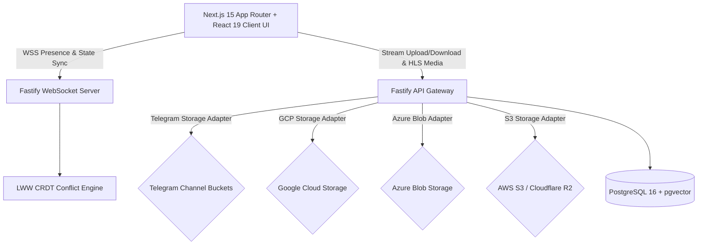

# BucketSpace Project State & Active Memory (PROJECT_STATE.md)

This document is the **Active Project Memory** for **BucketSpace**. It tracks high-level project goals, active architectural rules, roadmap state, and production-readiness requirements.

When architecture, goals, or rules change, this document MUST be updated, removing deprecated architectural patterns and establishing new baseline decisions.

---

## 1. Core Project Goal & Vision
Build a production-grade, ultra-secure, reliable, and high-performance **AI-First Telegram Cloud Drive & Multi-Cloud Storage Workspace**. Phase 1 established **Telegram Private Channel Storage**. Phase 2 extended to **GCP Storage**, **Azure Blob**, **AWS S3 / Cloudflare R2**, **HLS Video Streaming**, and **WebSocket Presence**. Phase 3 integrated **Whisper Speech-to-Text, Document OCR, pgvector Semantic Search, and Cross-Cloud Bucket Sync**. Phase 4 delivers **Multi-Cloud Cost Analytics, Automated Lifecycle Migration Rules, and SOC 2 / HIPAA Tamper-Evident Compliance Audit Exports**.

---

## 2. Active Engineering Behavioral Rules

1. **Automated Git Commit and Push Protocol**:
   - Whenever any task or coding request is completed, automatically stage all changes (`git add .`), commit with a descriptive message, and push to the remote repository (`git push origin <branch>`).
2. **Active Architectural State Maintenance**:
   - Keep `context/PROJECT_STATE.md` and the `/context` documentation hub in sync with all architectural decisions, goal changes, and system rules.
   - Instantly remove deprecated architecture sections when replacement patterns are adopted.
   - Omit casual conversation; retain only technical goals, rules, and architecture specs.
3. **Human-Centric Clean Code & Modular Feature Structure**:
   - Every module must be intuitively grouped by feature functionality (`modules/telegram`, `modules/media`, `modules/websocket`, `components/file`, `components/media`) so any developer can easily understand the codebase.
   - Code must be clean, readable, self-documenting, and free from AI-style boilerplate bloat or unnecessarily complex abstractions.

---

## 3. Active System Architecture Baseline

- **Universal Storage Provider Engine**: `IStorageProvider` contract implemented by `TelegramStorageAdapter`, `GCPStorageAdapter`, `AzureBlobStorageAdapter`, and `S3StorageAdapter`.
- **HLS Video Preview Engine**: Fastify `MediaController` generating dynamic `.m3u8` playlists and TS video segment streaming.
- **WebSocket Presence & Sync**: Fastify WebSocket server (`WebSocketController`) handling workspace presence badges, dynamic cursors, and Last-Write-Wins (LWW) CRDT metadata conflict resolution.
- **Frontend**: Next.js 15 App Router with Tailwind CSS dark glassmorphic design, `HLSVideoPlayer`, `useWebSocketSync`, and multi-cloud file management.
- **Database**: PostgreSQL 16 + `pgvector` for file metadata, chunk maps, embeddings, and audit logs.

---

## 4. Current Milestone & Focus
- **Active Phase**: Phase 4 — **Enterprise Automation & Governance** ✅ COMPLETED.
- **Key Phase 4 Deliverables**:
  - **Multi-Cloud Cost Recommendation & Analytics Engine**: Telemetry aggregator in `apps/api/src/modules/enterprise/cost.service.ts` calculating storage breakdown across 6 storage providers with automated cost optimization algorithms.
  - **Automated Lifecycle Policy & Migration Engine**: Rule engine in `apps/api/src/modules/enterprise/lifecycle.service.ts` processing file age/size policies for automated cross-cloud chunk tiering and soft deletion.
  - **SOC 2 & HIPAA Compliance Audit Log Export Engine**: Tamper-evident log query engine in `apps/api/src/modules/enterprise/compliance.service.ts` generating SHA-256 HMAC cryptographic chain-of-custody audit reports (JSON/CSV).
  - **Enterprise API Controller**: Fastify routes (`GET /api/v1/enterprise/cost-analytics/:workspaceId`, `POST /api/v1/enterprise/lifecycle`, `POST /api/v1/enterprise/lifecycle/:ruleId/execute`, `GET /api/v1/enterprise/compliance/export/:workspaceId`).
  - **Frontend UI Components**: Next.js 15 `CostAnalyticsPanel` (multi-cloud cost breakdown & auto-optimization trigger) and `GovernanceAuditModal` (tamper-evident audit log viewer with CSV export).

---

## 5. Security & Reliability Directives
- **Multi-Cloud Isolation**: Dedicated bucket isolation for Telegram Channels, GCP Buckets, Azure Containers, and S3 Buckets.
- **Credentials Protection**: Envelope encryption for cloud tokens and access keys.
- **Conflict Resolution**: LWW CRDT with deterministic 3-tier tie-breaking (timestamp → vectorClock → userId).
- **Rate Limit Resilience**: Provider-specific backoff retry mechanisms for 429 rate limit responses.
- **Memory Safety**: Stream buffering capped at safety limits (52MB–100MB) via shared `streamToBuffer` utility.
- **XSS Prevention**: All user-provided content (filenames) XML-escaped before SVG rendering.
- **Connection Health**: Server-side WebSocket ping/pong heartbeat (30s) with dead connection cleanup.
- **Transactional Sync Safety**: Cross-cloud sync reads source chunks stream-by-stream and commits destination records transactionally with full audit logging.
